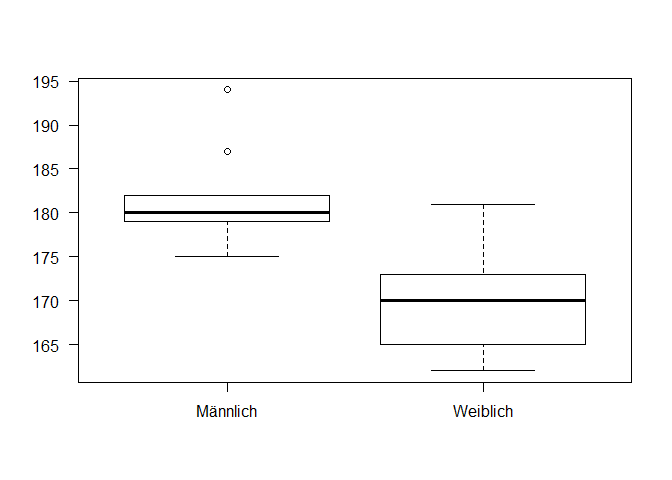
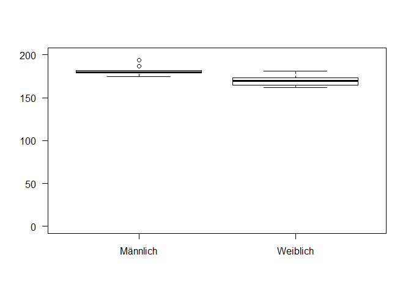

# Biostatistik - Übung zu Vorlesung 1
Lisa Hülsmann & Florian Hartig  
26 Oktober 2017  


## Ziel der Übungen

* Vorlesungsinhalte an praktischen Beispiele wiederholen!
* offene Fragen beantworten!
* Aber: kein R-Kurs (R nicht klausur-relevant)!


## Daten einlesen und prüfen

Als erstes lesen wir die Daten ein. Das geht zum Beispiel mit der read.csv Funktion. Wenn Sie das zu Hause ausprobieren wollen müssen Sie natürlich den Pfad ändern


```r
Daten <- read.csv("C:/Users/LocalAdmin/Work/Teaching/@UR/Statistik@Git/Courses/BScBiostatistik/Daten.csv")
```

Sie können Daten aber auch über den Reiter "Environment" im Fenster rechts oben, und dann "Import Dataset" einlesen. 

Übrigens können Sie in der R-Hilfe nachschauen, was eine Funktion macht und an Argumenten erwartet. Das geht entweder über 


```r
?read.csv
```

```
## starting httpd help server ...
```

```
##  done
```

oder mit der Maus den Cursor auf die Funktion setzen, und dann F1 drücken. 

Bemerkung: diese und weitere technischen Kommentare zu Details der Sprache R sind nicht klausurrelevant. Ich möchte nur dass Sie verstehen was wir hier machen. 

Die Daten sind jetzt in R als Tabelle die den Namen "Daten" hat. Als erstes sollten wir überprüfen ob R auch den Typ der Variable korrekt erkannt hat. Das geht über den str() Befehl (steht für structure, Struktur)


```r
str(Daten)
```

```
## 'data.frame':	29 obs. of  10 variables:
##  $ Einwohnerzahl       : int  19500 11 1500 10000 1969 11000 61900 290 140000 8910 ...
##  $ Distanz             : int  140 64 184 200 80 100 150 150 0 100 ...
##  $ Körpergröße         : int  187 164 163 180 180 167 168 173 181 171 ...
##  $ SchwierigkeitStudium: Factor w/ 3 levels "Leicht","Mittel",..: 2 2 3 2 1 1 2 3 1 3 ...
##  $ Semesterferien      : Factor w/ 3 levels "genau richtig (hat gerade gereicht den gesamten Stoff des 5. Semesters vorzuarbeiten)",..: 3 1 2 1 1 1 1 1 2 2 ...
##  $ Geschlecht          : Factor w/ 2 levels "Männlich","Weiblich": 1 2 2 1 1 2 2 2 1 2 ...
##  $ Augenfarbe          : Factor w/ 3 levels "Blau","Braun",..: 1 2 2 1 2 3 1 1 2 1 ...
##  $ Transport           : Factor w/ 4 levels "Auto","Bus","Fahrad",..: 4 2 3 3 4 4 4 3 2 4 ...
##  $ Feierabendgetränk   : Factor w/ 5 levels "Bier","Cocktails / Longdrinks",..: 1 2 1 4 3 3 3 3 4 4 ...
##  $ Vegetarier          : Factor w/ 2 levels "Ja","Nein": 2 2 2 1 1 1 2 2 2 2 ...
```

Sie sehen dass die Daten aus 29 Beobachtungen von 10 Variablen bestehen. 

Bei den numerischen Variable steht "int". Das ist OK, und bedeutet dass die Variable integer, also ganzzahlig sind. 

Bei den kategorialen Variablen steht "Factor" - auch das ist korrekt. Das ist der R Name für kategoriale Variablen.

Bei den kategorialen Daten werden Ihnen auch gleich die Kategorien angezeigt. Es lohnt sich hier zu schauen ob das korrekt ist. Oft gibt es in Datensätzen Rechtschreibfehler, so dass Kategorien nicht richtig zugeordnet werden. 


## Univariate deskriptive Statistiken

Man kann sich eine Zusammenfassung der Daten anzeigen lassen über


```r
summary(Daten)
```

```
##  Einwohnerzahl          Distanz       Körpergröße    SchwierigkeitStudium
##  Min.   :     11.0   Min.   :  0.0   Min.   :162.0   Leicht: 3           
##  1st Qu.:    322.5   1st Qu.: 76.0   1st Qu.:167.8   Mittel:10           
##  Median :   6800.0   Median :135.0   Median :173.0   Schwer:15           
##  Mean   :  99212.0   Mean   :137.5   Mean   :173.8   NA's  : 1           
##  3rd Qu.:  64675.0   3rd Qu.:172.5   3rd Qu.:180.0                       
##  Max.   :1430000.0   Max.   :400.0   Max.   :194.0                       
##  NA's   :1           NA's   :1       NA's   :1                           
##                                                                                                                                                               Semesterferien
##  genau richtig (hat gerade gereicht den gesamten Stoff des 5. Semesters vorzuarbeiten)                                                                               : 6    
##  zu kurz (wollte eigentlich noch ein Onlineseminar in Differentialgeometrie belegen, jetzt muss ich mich wieder mit den trivialen Inhalten des Biostudiums befassen ):19    
##  zu lange (kann es kaum erwarten endlich wieder Klausuren schreiben, hätte fast noch eine Führerscheinprüfung gemacht nur um mal wieder einen Test zu haben)         : 3    
##  NA's                                                                                                                                                                : 1    
##                                                                                                                                                                             
##                                                                                                                                                                             
##                                                                                                                                                                             
##     Geschlecht Augenfarbe  Transport               Feierabendgetränk
##  Männlich:10   Blau :11   Auto  : 5   Bier                  : 8     
##  Weiblich:18   Braun:12   Bus   :10   Cocktails / Longdrinks: 1     
##  NA's    : 1   Grün : 5   Fahrad: 5   Tee                   :10     
##                NA's : 1   Zu Fuß: 8   Waser                 : 8     
##                           NA's  : 1   Wein                  : 1     
##                                       NA's                  : 1     
##                                                                     
##  Vegetarier
##  Ja  : 9   
##  Nein:19   
##  NA's: 1   
##            
##            
##            
## 
```

Diese Funktion zeigt für jede Spalte im Datensatz die folgenden Informationen an:

* Numerische Variablen
 * min / max
 * 1. und 3. Quartil (0.25 und 0.75 Quantil)
 * Mittelwert
 * Median
 * NA's

* Kategoriale Variablen
 * Häufigkeit  
 
NA heißt dass hier keine Information verfügbar ist, also eine fehlende Messung. Das tritt in fast jedem Datensatz auf. Es lohnt sich ein Auge auf die Anzahl von NAs zu haben weil das für eine spätere Analyse wichtig ist. 
 
Auf die einzelnen Spalten (Variablen) des Datensatzes kann man mit 


```r
Daten$Einwohnerzahl
```

```
##  [1]   19500      11    1500   10000    1969   11000   61900     290
##  [9]  140000    8910    2000  125000    7000   13800      80   80000
## [17]     330     300      22    6600  280000    3500  500000      11
## [25]   73000 1430000    1194      18      NA
```

zugreifen. Weil das aber etwas lästig ist gibt es den Befehl


```r
attach(Daten)
```

der alle Spalten direkt im "Workspace verfügbar macht". D.h. nach diesem Befehl kann man direkt


```r
Einwohnerzahl
```

```
##  [1]   19500      11    1500   10000    1969   11000   61900     290
##  [9]  140000    8910    2000  125000    7000   13800      80   80000
## [17]     330     300      22    6600  280000    3500  500000      11
## [25]   73000 1430000    1194      18      NA
```

schreiben um auf die Einwohnerzahl zuzugreifen. 

Dann schauen wir uns die Einwohnerzahl doch mal an. Ausgehend von den Quartilen, Mittelwert und Median, was würden Sie für eine Verteilung erwarten?


```r
summary(Einwohnerzahl)
```

```
##      Min.   1st Qu.    Median      Mean   3rd Qu.      Max.      NA's 
##      11.0     322.5    6800.0   99212.0   64675.0 1430000.0         1
```


Hoffentlich haben Sie gesehen dass die Abstände von 1st, 2. (Median) und 3. Quartil größer werden. Außerdem ist der Mittelwert viel größer als der Median. All dies deutet auf eine rechtsschiefe Verteilung hin. 

Dann schauen wir mal 


```r
hist(Einwohnerzahl, breaks = 50)
```

<!-- -->

Also, wir haben eine starke Häufung von kleinere Orten, und nur wenige große Städte die die Verteilung nach rechts ziehen. Vielleicht sollten wir die rechtsschiefe aber noch mal formal ausrechen. Also, wie war das, sollte die Schiefe jetzt postiv oder negativ sein?


```r
library(moments)
skewness(Einwohnerzahl, na.rm = T)
```

```
## [1] 4.046526
```

Genau, sie sollte positiv sein. 


Bemerkungen: 1) R hat viele Befehle die nicht standardmäßig aktiviert sind, sondern die durch das Laden einer Bibliothek aktiviert werden müssen. Dies geschieht durch den library Befehl. 2) das na.rm = T sagt dem Befehl dass die NAs ignoriert werden sollen. 

Wie sieht es denn mit der Körpergröße aus?


```r
summary(Körpergröße)
```

```
##    Min. 1st Qu.  Median    Mean 3rd Qu.    Max.    NA's 
##   162.0   167.8   173.0   173.8   180.0   194.0       1
```

Hier würde ich sagen, es ist nicht ganz so klar, wenn man sich die Quartile anschaut. Aber man könnte eventuell eine leichte Rechtsschiefe erwarten, aus ähnlichen Gründen wie oben. 

Dann schauen wir noch mal auf die Verteilung


```r
hist(Körpergröße, breaks = 50)
```

<!-- -->

Ja, es sieht leicht rechtsschief aus. Überprüfen wir das auch noch mal numerisch


```r
skewness(Körpergröße, na.rm = T)
```

```
## [1] 0.5156891
```


Vielleicht ist es an dieser Stelle ja mal Instruktiv alle Statistiken, die wir kennengelernt haben, an diesem Beispiel zu berechnen


```r
Mittelwert = mean(Körpergröße, na.rm = T)
Median = median(Körpergröße, na.rm = T)
Maximum = max(Körpergröße, na.rm = T)
Minimum = min(Körpergröße, na.rm = T)
Quantile = quantile(Körpergröße, na.rm = T)
Varianz = var(Körpergröße, na.rm = T)
Standardabweichung = sd(Körpergröße, na.rm = T)
Schiefe = skewness(Körpergröße, na.rm = T)
Wölbung = kurtosis(Körpergröße, na.rm = T)
```

Erinnern Sie sich noch wie Standardabweichung und Varianz zueinander stehen?

Plotten wir doch noch mal die Quartile auf die Verteilung


```r
hist(Körpergröße, breaks = 50); abline(v = Quantile, col = "red", lwd = 2)
```

<!-- -->

Sie sehen dass die Abstände der Quartile leicht weiter werden nach rechts. Das zeigt die Rechtsschiefe an. 

Übrigens, haben Sie gemerkt dass das 0-Quantil ein anderes Wort für das Minimum ist?

Noch ein Kommentar zur Wölbung. Die Wölbung einer Normalverteilung ist 3. Deshalb wird manchmal statt der eigentlichen Wölbung der Exzess (Unterschied zur Normalverteilung) angegeben. Unsere Wölbung ist 


```r
Wölbung
```

```
## [1] 2.938489
```

Also ist der Excess 


```r
Wölbung - 3
```

```
## [1] -0.06151063
```

D.h. die Verteilung der Distanzen ist "flacher" als bei einer Normalverteilung. 


Wo wir gerade von Normalverteilungen reden - kennen Sie die Normalverteilung? 

Graphisch sieht sie so aus. 


```r
curve(dnorm(x), -5,5)
abline(v = c(0))
lines(x = c(-1,1), y = dnorm(c(-1,1)), col = "red", lwd = 2)
lines(x = c(-2,2), y = dnorm(c(-2,2)), col = "red", lwd = 2)
```

<!-- -->


Das interessante an der Formel für die Normalverteilung ist, dass die Parameter der Verteilung auch direkt dem Mittelwert und der Standardabweichung entsprechen. Dies hat entscheidende Vorteile für statistische Anwendungen. Daher wird Ihnen die Normalverteilung immer wieder begegnen!


Mit den roten Linien habe ich den Bereich von 1 und 2 Standardabweichungen vom Mittelwert eingezeichnet. 63% der Daten liegen +/- 1 Standardabweichung vom Mittelwert.


Ich glaube wir haben die numerischen Daten genügend behandelt. Schauen wir uns zuletzt noch mal die kategorischen Daten an. 

In R kann man sich eine Tabelle über den table Befehl ausgeben lassen. 


```r
table(Transport)
```

```
## Transport
##   Auto    Bus Fahrad Zu Fuß 
##      5     10      5      8
```

Das ist jetzt nicht so spektakulär schwierig zu interpretieren. Schauen wir uns das doch gleich mal optisch an. 


```r
oldpar <- par(mfrow = c(2,3))
plot(Transport, las=1)
plot(Augenfarbe, las=1)
plot(Geschlecht, las=1)
plot(SchwierigkeitStudium, las=1)
plot(Feierabendgetränk, las=1)
plot(Vegetarier, las=1)
```

<!-- -->

```r
par(oldpar)
```


## Multivariate deskriptive Statistiken (AUSBLICK)

Natürlich liegt es jetzt auf der Hand mal zu schauen ob es Abhängigkeiten zwischen bestimmten Variablen gibt. Zum Beispiel könnten wir uns anschauen ob es eine Abhängigkeit zwischen der Körpergröße und dem Vergehrsmittel gibt. 


```r
boxplot(Körpergröße ~ Geschlecht, las=1)
```

<!-- -->

Und was ist jetzt die erklärende und was die abhängige Variable?


Hier geht die Achse aber nicht bei 0 los ... das kann verwirrend sein. So noch mal anders.


```r
boxplot(Körpergröße ~ Geschlecht, ylim = c(0,200), las=1)
```

<!-- -->


Sind denn größere Menschen vielleicht auch mehr mit den Fahrad unterwegs?


```r
boxplot(Körpergröße ~ Transport, las=1)
```

<!-- -->

Da kann man so nicht viel sehen. 


Man kann natürlich auch kategoriale Variablen anschauen. 

Zum Beispiel ob sich das Geschlecht auf den Fleischkonsum auswirkt.

Dazu kann man zwei Variablen gemeinsam tabellarisieren und dann darstellen. Die Größe der Rechtecke zeigt an, wie häufig eine Beobachtung ist. 


```r
plot(table(Geschlecht, Vegetarier))
```

<!-- -->

Frauen sind anscheinend häufiger Vegetarier.


Und hier Ihre eigenen Hypothesen:


```r
plot(table(Augenfarbe, Vegetarier))
```

<!-- -->

```r
boxplot(Körpergröße ~ Vegetarier)
```

<!-- -->

```r
plot(table(SchwierigkeitStudium, Vegetarier))
```

<!-- -->


Noch eine Bemerkung für Abschlussarbeiten:

* Grafiken sollten Sie exportieren als pdf, nicht png oder tiff (weil Vektorgrafik, höhere Qualität und kleine Größe)
* Kann dann auch mit Illustrator (kommerziell) oder Inkscape nachbearbeitet werden. 


```r
detach(Daten)
```


## Infos zum Schluss

Ab nächster Woche werden nach der Vorlesung Übungsfragen im GRIPS hochgeladen (zur Vorbereitung der Übung). 

Am 2.11. fällt die Übung aus (Infomail folgt).


