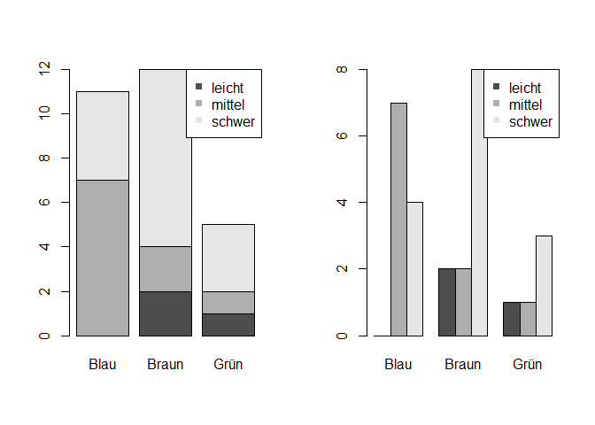
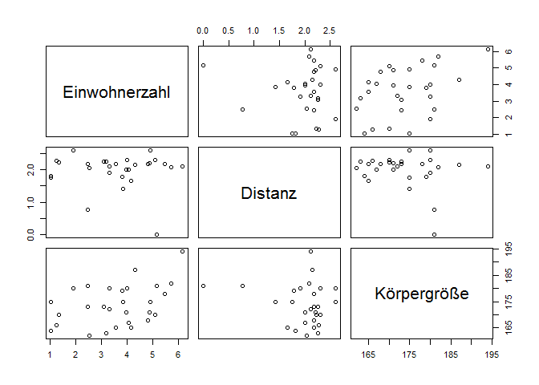
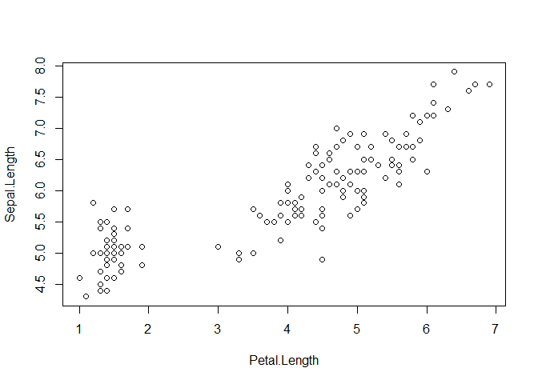

# Übung zur Vorlesung 2 - Multivariate Deskriptive Statistik
Lisa Hülsmann & Florian Hartig  
9 Nov 2017  


# Demonstration multivariate Statistik


```r
Klasse <- read.csv("C:/Users/LocalAdmin/Work/Teaching/@UR/Statistik@Git/Courses/BScBiostatistik/Daten.csv")
attach(Klasse)
```


## Assoziation zweier nominaler Variablen

Schauen wir uns doch mal an ob die Augenfarbe was damit zu tun hat wie schwer Sie das Studium finden - so ein Effekt ist zwar nicht zu erwarten, aber es ermöglichst uns ein paar Plots zu machen. 

In der Kontingenztabelle sehen wir die Häufigkeit der verschiedenen Kombinationen


```r
Kontingenztabelle = table(Augenfarbe, SchwierigkeitStudium)
Kontingenztabelle
```

```
##           SchwierigkeitStudium
## Augenfarbe Leicht Mittel Schwer
##      Blau       0      7      4
##      Braun      2      2      8
##      Grün       1      1      3
```

Frage: wie kann man die Kontingenztabelle visualisieren? 

Antwort: genau, entweder als barplot


```r
par(mfrow = c(1,2))

barplot(t(Kontingenztabelle), beside = F)
legend("topright", legend = c("leicht", "mittel", "schwer"), col = gray.colors(3), pch = 15)

barplot(t(Kontingenztabelle), beside = T)
legend("topright", legend = c("leicht", "mittel", "schwer"), col = gray.colors(3), pch = 15)
```

<!-- -->

oder als Mosaikplot


```r
mosaicplot(Kontingenztabelle)
```

<!-- -->

Frage: Wie ist das jetzt - zeigen die Daten dass Studierende mit braunen Augen ihr Studium schwerer finden?

Richtige Antwort: nein! Um solche Schlüsse zu ziehen brauchen wir die inferentielle Statistik (nächste Woche). Die deskriptive Statistik sagt erst mal nur faktisch dass in diesen Daten viele Personen, die braune Augen haben, "schwer" angekreuzt haben. Die deskriptive Statistik ist aber kein Instrument um daraus allgemeine Schlüsse über einen Zusammenhang zu ziehen.

## Assoziation von numerisch und kategorial (nominal)

Frage: Was benutzen wir für die Visualisierung der Assoziation von numerisch und kategorial (nominal)?

Antwort: Boxplot


```r
boxplot(log10(Einwohnerzahl) ~ Augenfarbe, col = "grey")
```

<!-- -->

Den sollten sie dann auch vollständig interpretieren können. 

Machen Sie sich noch mal klar dass die Breite der Boxen nur ein Maß für die Verteilung ist, aber KEINE Aussage darüber ermöglicht ob die Unterschiede systematisch sind. Sie können dass daran sehen dass die Boxen sich eigentlich nicht ändern sollten wenn Sie mehr Daten sammeln. Ihre Sicherheit über den Unterschied sollte aber mit einer steigenden Anzahl von Daten zunehmen. 

## Korrelation von numerisch und numerisch

Darstellung


```r
plot(log10(Einwohnerzahl), Körpergröße)
```

<!-- -->

Nehmen wir mal die Körpergröße als Info dazu


```r
plot(log10(Einwohnerzahl), Körpergröße, cex = log10(Distanz + 1))
```

<!-- -->

Und dann noch die Augenfarbe


```r
plot(log10(Einwohnerzahl), Körpergröße, cex = log10(Distanz + 1), pch = 16, col = c("darkblue", "brown", "darkgreen")[Augenfarbe])
```

<!-- -->

Frage: erwarten Sie eine Korrelation zwischen Einwohnerzahl und Distanz? Welche Richtung

Dann schauen wir mal


```r
cor(log10(Einwohnerzahl), Körpergröße, use = "complete.obs")
```

```
## [1] 0.4175573
```

das sieht ja nach einer starken Korrelation aus! Aber stimmt das?

der Standard in R ist Pearson. Versuchen wir doch mal die Rank-correlation 


```r
cor(log10(Einwohnerzahl), log10(Distanz + 1), use = "complete.obs", method = "kendall")
```

```
## [1] 0.01879332
```

```r
cor(log10(Einwohnerzahl), log10(Distanz + 1), use = "complete.obs", method = "spearman")
```

```
## [1] 0.01782534
```

Jetzt ist es nur noch leicht positv ... Das liegt am Ausreißer: die größte Person kam aus der größten Stadt!


also, merken Sie sich - das Kleingedruckte lesen bei Korrelationen - Pearson (linear) und Rangkorrelationen (Spearman, Kendall) zeigen oft Unterschiede. 

Als letztes noch mal ein pairplot ... machen Sie sich klar dass das nur lineare Korrelationen sind


```r
pairs(data.frame(Einwohnerzahl=log10(Einwohnerzahl), Distanz=log10(Distanz + 1), Körpergröße))
```

<!-- -->


```
## Warning: package 'effects' was built under R version 3.4.2
```

```
## Loading required package: carData
```

```
## lattice theme set by effectsTheme()
## See ?effectsTheme for details.
```


# Testfragen

## Univariate Verteilungen 

1. Die Varianz einer beobachteten Variable kann nicht 0 werden

2. Bei einer assymetrischen Verteilung ist der Mittelwert immer größer als der Median

3. Wenn der Abstand der Quartile von links nach rechts abnimmt ist die Verteilung a) linksschief b) rechtsschief c) gar nicht schief

4. Ist es möglich eine Varianz von 4 und eine Standardabweichung von 3 zu haben?

5. Zeichnen Sie mit Hand die geschätzten Werte für a) 25%, 50%, 75% Quantil, und Mittelwert der folgenden Verteilung ein (es geht nur um die grobe relative Struktur) 


```r
data = runif(10000, 0, 2)
hist(exp(data), breaks = 100, main = "", xlab = "")
```

<!-- -->


## Deskriptive Statistik mit 2 Variablen

1. Welche Kombinationen von 2 Variablen unterschiedlichen Skalenniveaus (ungeordnet, metrisch) wurden in der Vorlesung durchgenommen?

2. Schauen Sie sich den folgenden Mosaikplot der Überlebenden der Titanik an


```r
mosaicplot(table(TitanicSurvival$sex, TitanicSurvival$survived), main = "", ylab = "Überleben", xlab = "Geschlecht")
```

<!-- -->

 a) Haben relativ mehr Frauen überlebt? Woran sieht man das?

 b) Haben absolut mehr Frauen überlebt?  Woran sieht man das?

3. Schauen Sie sich den folgeden Boxplot an


```r
boxplot(weight ~ group, data = PlantGrowth, col = "lightgrey") 
```

<!-- -->

 a) Sind die Mediane der 3 Behandlungen gleich gleich?

 b) Was können Sie über die Symmetrie / Schiefe der Verteilung der Kontrolle (ctrl) sagen?

 c) Gibt es Ausreißer / outlier?

 d) Welche Behandlung hat die kleinste Varianz

 e) Ist der Unterschied zwischen den Behandlungen signifikant, d.h. gibt es einen Effekt der Behandlungen gegenüber der Kontrolle?

4. Schauen Sie auf die folgende Korrelation zwischen Kelchblatt und Kronblatt von verschiedenen Blüten


```r
plot(Sepal.Length ~ Petal.Length, data = iris )
```

<!-- -->

a) Sind die Datenpunkte korreliert (deskriptiv), und wenn ja, positiv oder negativ?

b) Denken Sie dass es einen deutlichen Unterschied zwischen den Korrelationskoeffizienten von Pearson und Spearman gibt?


5. Schauen Sie sich die folgende PCA an  (nun sind zur vorherigen Abbildung noch zwei Variablen hinzugekommen).


```r
biplot(prcomp(iris[, 1:4], scale. = T), xlim=c(-0.25, 0.25), ylim=c(-0.25, 0.25), col=c("grey", "red"), cex=0.8)
```

<!-- -->

a) Was zeigen die roten Pfeile an?

b) Welche der Variablen entspricht der zweiten Achse?

c) Wenn man nur zwei Variablen aufnehmen könnte: Mit welchen beiden Variablen zusammen würde man am meisten Variabilität der Daten erklären?


# Antworten

## Univariat

1. Falsch, die Varianz ist immer >= 0. Wenn alle Datenpunkte gleich sind ist sie 0, sie kann also 0 werden.

2. Falsch, größer oder kleiner, je nachdem ob die Verteilung rechtsschief oder linksschief ist

3. a

4. Nein

5. s.u., Mittelwert ist grün


```r
data = runif(10000, 0, 2)
hist(exp(data), breaks = 100, main = "", xlab = "")
abline(v = quantile(exp(data), probs  = c(0.25,0.5,0.75)), col = "red", lwd = 2)
abline(v = mean(exp(data)), col = "green", lwd = 2)
```

<!-- -->

## Multivariat

1. u-u, u-m, m-u, m-m

2. -a) ja, man sieht das am höheren vertikalen Übergang von ja / nein bei den Frauen b) sieht auch so aus - man muss den Flächeninhalt der beiden Felder vergleichen.

3. -a) nein b) assymetrisch, tendentiell linksschief (median nach rechts verschoben) c) ja, Punkt in trt1 d) trt2 e) das kann man aus so einem Plot nicht sagen

4. -a) ja, positiv, b) es gibt zwar diesen Cluster an Punkten links unten, aber da die Daten trotzdem mehr oder weniger linear sind, eher nicht (in der Tat, die Werte sind 0.87 und 0.88). 

5. a) den Beitrag der vier Variablen an den beiden Achsen / Hauptkomponenten b) Sepal.Width (und ein wenig Sepal.Length) c) Petal.Length und Sepal.Width


