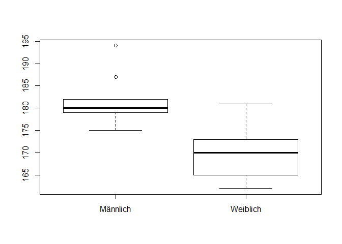
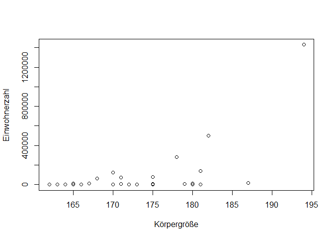

# Übung zur Vorlesung 3 - Hypothesentests
Lisa Hülsmann & Florian Hartig  
16 Nov 2017  


# Wiederholung PCA

Zur Wiederholung der Hauptkomponentenanalyse habe ich Ihnen noch mal ein anschauliches Beispiel vorbereitet.

Es handelt sich um den Datensatz "olympic", der die Ergebnisse von 33 Sportlern im Zehnkampf enthält. Jeder Sportler hat also eine Bewertung in 10 Disziplinen bekommen, also recht multivariat. 

100m Lauf (100), 110m Hürden (110), 1500m Lauf (1500), 400m Lauf (400), Diskus werfen (disq), Hochsprung (haut), Speerwurf (jave), Weitsprung (long), Stabhochsprung (perc), Kugelstoßen (poid)!

Schauen Sie sich die folgenden beiden Darstellungen an.

Der erste ist eine Abbildung der Spearman-Korrelationen. Leistungen welcher Disziplinen sind korreliert, positiv oder negativ? 

In der zweiten Abbildungen sehen sie die ersten beiden Kompenenten der PCA und in rot die Anteile und Richtungen der Disziplinen an den ersten beiden Komponenten. Wo finden sich nun die korrelierten Variablen? Und wie würden Sie die ersten beiden Komponenten interpretieren?

Diskutieren Sie fünf min mit Ihrem Nachbarn. 


```
## Warning: package 'ade4' was built under R version 3.4.2
```

```
## Warning: package 'corrplot' was built under R version 3.4.2
```

```
## corrplot 0.84 loaded
```

<!-- -->

Die Laufdisziplinen (auch Hürde) sind positiv miteinander korreliert. Ebenso die Wurfdisziplinen Speer, Diskus und Kugelstoßen. Die Sprungdisziplinen sind leicht positiv miteinander korreliert. Die Lauf- und Sprungdisziplinen sind negativ miteinander korreliert.

Die Pfeile der positiv korrelierten Variablen zeigen in die gleiche Richtung, negativ korrelierte in die entgegengesetzte Richtung. 

Die erste Komponente scheint mehrheitlich die Lauf- und Sprungleistung aufzuzeigen (Tradeoff?). Die zweite Komponente scheint die Kraft eines Sportlers zu beschreiben. 


# Variabilität 

Machen wir uns noch mal klar dass durch zufällige Variabilität Muster in Daten entstehen können die zwar aussehen wie ein Effekt, aber nicht systematisch sind. Hier das Beispiel eines Experimentes in dem der Erfolg eines Medikamentes getestet wurde. Es gibt 2 Gruppen, einmal die Kontrolle (kein Medikament), und zum zweiten die Behandlung. Ich habe den Zufallsgenerator aber so programmiert dass beide Gruppen den gleichen Behandlungserfolg haben. Trotzdem sehen ist der gemessene Erfolg in der Behandlungsgruppe höher


```r
set.seed(123)
Daten = data.frame(Geheilt = rbinom(50, 1, 0.5), Behandlung = rep(c("Kontrolle", "Behandlung"), each = 25))
x = table(Daten$Geheilt, Daten$Behandlung)
barplot(x)
```

<!-- -->

Wenn wir viele Computerexperiment machen sehen wir aber dass dass ein solches Ergebnis nicht außergewöhnlich ist, sondern im Rahmen der normal erwarteten Streuung einer solchen, relativ kleinen Stichprobe liegt. Wenn sie die folgende Animation zu Hause sehen wollen müssten Sie das in R laufen lassen.


```r
library(animation)

oopt = ani.options(interval = 0.5, nmax = 50)
## use a loop to create images one by one
for (i in 1:ani.options("nmax")) {
    Daten = data.frame(Geheilt = rbinom(50, 1, 0.5), Behandlung = rep(c("Kontrolle", "Behandlung"), each = 25))
    xn = table(Daten$Geheilt, Daten$Behandlung)
    barplot(xn)
    ani.pause()  ## pause for a while ('interval')
}
## restore the options
ani.options(oopt)
```

# Hypothesentests

Die Frage die wir uns also stellen wenn wir beobachtete Daten bekommen: zeigen diese einen eindeutigen systematische Effekt an, oder könnten die Daten genausogut durch Zufall entstanden sein?

Hypothesentests beantworten diese Frage durch den folgenden Ansatz

1. Wir denken uns erst mal ein Modell M für die Streuung der Daten aus
2. Dann erstellen wir eine Nullhypothese H0, typischerweise dass es keine systematischen Effekte gibt und die Variabilität in den Daten nur durch die zufällige Streuung kommt die in M beschrieben wird (H0 beinhaltet M)
3. Dann denken wir uns eine Teststatistik aus die den untersuchten Effekt beschreibt
4. Jetzt benutzen wir H0 mit M und überlegen uns was wir für Werte für die Teststatistik erwarten würden wenn H0 wahr wäre - der p-Wert ist dann definiert als p(d >= D| M, H0), also die Wahrscheinlichkeit dass die beobachteten Daten D gleich oder größer sind als die Daten d die unter M, H0 erwartet werden. >= ist in Bezug auf die Teststatistik
5. Wenn p < 0.05 wird sagen wir der Effekt ist signifikant, und wir können die Nullhypothese ablehnen

## Beispiel Medikament

Gehen wir das mal durch für unser Beispiel

1. Modell ist das Binominialmodell - Münzwurf mit einer festen Wahrscheinlichkeit von Behandlungserfolg p
2. H0: p ist identisch für Behandlung und Kontrolle
3. Teststatistik: Unterschied in den Proportionen
4. Wahrscheinlichkeit - die kann man exakt ausrechenen (wie gesagt, die Binominialformel war ja eigentlich Abistoff). In R bekommen Sie die Wahrscheinlichkeit mit der prop.test funktion
5. Wenn es < 0.05 ist sagen wir es ist signifikant - dann schauen wir doch mal für die Daten oben 


```r
prop.test(x)
```

```
## 
## 	2-sample test for equality of proportions with continuity
## 	correction
## 
## data:  x
## X-squared = 2.88, df = 1, p-value = 0.08969
## alternative hypothesis: two.sided
## 95 percent confidence interval:
##  -0.02609353  0.58609353
## sample estimates:
## prop 1 prop 2 
##   0.64   0.36
```

der p-Wert ist also 0.09 ... das ist ...

Genau, nicht signifikant.

Was sagt uns das?

Richtige Antwort: ein signifikanter Effekt konnte nicht nachgewiesen werden. Das ist aber kein Beweis dafür dass kein Effekt da ist.

Falsche Antwort: der p-Wert > 0.05, also sind wir sicher dass es keinen Effekt gibt. Merken Sie sich: wenn das Ergebnis nicht signifikant ist können Sie nichts sagen. 

Wenn sie genau auf das Ergebnis schauen sehen Sie die Bemerkung "alternative hypothesis: two.sided" - das heißt dass der Test sowohl testet ob mit dem Medikament eventuell MEHR also auch WENIGER Patienten geheilt werden als in der Kontrolle. 

Wenn Sie sicher sind dass das Medikament nur eine positive Wirkung haben kann könnten Sie die Nullhypothese auch genauer fassen und sagen sie wollen nur auf positive Abweichungen testen


```r
prop.test(x, alternative = "greater")
```

```
## 
## 	2-sample test for equality of proportions with continuity
## 	correction
## 
## data:  x
## X-squared = 2.88, df = 1, p-value = 0.04484
## alternative hypothesis: greater
## 95 percent confidence interval:
##  0.01668727 1.00000000
## sample estimates:
## prop 1 prop 2 
##   0.64   0.36
```

Jetzt wäre der Test signifikant. Das liegt daran dass wir eine spezifischere Nullhypothese testen. Man sagt der Einseitige Test hat eine größere Power. 

**Vorsicht:** Jetzt könnten Sie doch denken: super, der einseitige Test hat mehr Power, dann mache ich es doch so: ich schaue mir erst mal die Daten an in welche Richtung der Effekt geht, und wenn ich sehe die Behandlung ist größer als die Kontrolle dann teste ich in die eine Richtung, und wenn die Behandlung kleiner ist dann teste ich in die andere - ** Das ist SEHR SEHR FALSCH ** - Wenn Sie ihre Nullhypothese gezielt auf die Daten anpassen können Sie immer signifikanz erzeugen. Sie können gerne einseitig testen, aber Sie müssen diese Entscheidung fällen bevor Sie sich die Daten angeschaut haben (siehe auch Bemerkung in der Vorlesung nächste Woche). 


## Typ I Fehler 

Ich wollte Ihnen noch mal zeigen dass es wiklich so ist das bei wiederholten Experimenten genau 5% falsche positive Entstehen - hier eine Wiederholung von 1000 Experimenten mit je 10.000 Teilnehmer, und einem Medikament dass keinen Effekt hat. Trotzdem entstehen 5% falsche positive.


```r
p = rep(NA, 1000)

for (i in 1:1000){
  Daten = data.frame(Geheilt = rbinom(10000, 1, 0.5), Behandlung = rep(c("Kontrolle", "Behandlung"), each = 5000))
  xn = table(Daten$Geheilt, Daten$Behandlung)
  test = prop.test(xn)
  p[i] = test$p.value
}
hist(p, breaks = 100, main= "Histogramm der p-Werte")
```

<!-- -->

```r
mean(p < 0.05) 
```

```
## [1] 0.049
```


## Power

Wir hatten bei unserem Experiment ja keinen Effekt. Vielleicht lag es ja daran dass wir nicht genug Samples hatten. Nehmen wir mal an der Effekt den wir gesehen hatten war echt - zur Erinnerung, das waren die Daten


```r
x
```

```
##    
##     Behandlung Kontrolle
##   0         16         9
##   1          9        16
```

mit den Proportionen 


```r
prop.test(x, alternative = "greater")
```

```
## 
## 	2-sample test for equality of proportions with continuity
## 	correction
## 
## data:  x
## X-squared = 2.88, df = 1, p-value = 0.04484
## alternative hypothesis: greater
## 95 percent confidence interval:
##  0.01668727 1.00000000
## sample estimates:
## prop 1 prop 2 
##   0.64   0.36
```

wenn die Propotionen wirklich so wären, wie viele Daten bräuchte man denn um einen Effekt zu sehen? Das sagt uns die Poweranalyse. R hat dafür die funktion 


```r
power.prop.test(n = 25, p1 = 0.64, p2 = 0.36)
```

```
## 
##      Two-sample comparison of proportions power calculation 
## 
##               n = 25
##              p1 = 0.64
##              p2 = 0.36
##       sig.level = 0.05
##           power = 0.5082837
##     alternative = two.sided
## 
## NOTE: n is number in *each* group
```

Mit unsere Stichprobengröße hatten wir als 50% power, d.h. 50% Wahrscheinlichkeit einen Effekt zu sehen (wenn 64/36 die wahren Propotionen sind, was man im Allgemeinen natürlich nicht weiß). Wie viele Daten bräuchten wir denn für 95% Power?


```r
power.prop.test(power = 0.95, p1 = 0.64, p2 = 0.36)
```

```
## 
##      Two-sample comparison of proportions power calculation 
## 
##               n = 79.87685
##              p1 = 0.64
##              p2 = 0.36
##       sig.level = 0.05
##           power = 0.95
##     alternative = two.sided
## 
## NOTE: n is number in *each* group
```

80 Beobachtugen pro Gruppe ... das ist schon deutlich mehr. 

## False Discovery Rate FDR

Stellen Sie sich vor wir testen 1000 Wirkstoffe gegen Krebs mit unserer vorherigen Stichprobengröße (n = 25). Nehmen wir mal an dass 90% der Mittel nicht wirken, aber wenn sie wirken dann bewirken sie eine Heilungsrate von 85%, gegenüber 75% ohne das Medikament. Sie testen ihren ersten Wirkstoff und er kommt signifikant zurück. Was ist die Wahrscheinlichkeit dass er wirklich wirkt?

Antwort: rechen wir erst mal die Power aus:


```r
power.prop.test(n = 25, p1 = 0.85, p2 = 0.75)
```

```
## 
##      Two-sample comparison of proportions power calculation 
## 
##               n = 25
##              p1 = 0.85
##              p2 = 0.75
##       sig.level = 0.05
##           power = 0.1390523
##     alternative = two.sided
## 
## NOTE: n is number in *each* group
```

Power ist 14%. Also, 14% der Stoffe die wirklich wirken kommen signifikant zurück, aber auch 5% der Stoffe die nicht wirken. Leider gibt es viel mehr Stoffe die nicht wirken. Also ist die Wahrscheinlichkeit dass ihr signifikantes Ergebnis in wirklichkeit eine "Niete" ist


```r
0.05*0.9 / (0.05*0.9  + 0.139*0.1)
```

```
## [1] 0.7640068
```

Wenn uns diese False discovery rate zu hoch ist, haben wir 2 Möglichkeiten. Welche?

1. Stichprobengröße erhöhen, das erhöht die Power
2. Siginfikanzlevel verringert, das verringert die falschen Positiven


# Andere Tests mit den Daten des Kurses


```r
Klasse <- read.csv("C:/Users/LocalAdmin/Work/Teaching/@UR/Statistik@Git/Courses/BScBiostatistik/Daten.csv")
attach(Klasse)
```


## Numerisch - Kategorial: der t-Test

Fangen wir doch mal an mit 


```r
boxplot(Körpergröße ~ Geschlecht)
```

<!-- -->

Numerische Abhängige Variable, kategorialer Prädiktor - was kann man da nehmen? 

Genau, t-test ... solange?

Genau, Normalverteilung der Gruppen. Schauen wir doch mal optisch

<!-- -->

Das sieht nicht so schlecht aus. Aber sind die jetzt wirklich normalverteilt? Wie könnte man das denn testen?

Genau, mit einem Test auf Normalverteilung. Da gibt es den Shapiro-Wilk test


```r
shapiro.test(Körpergröße[Geschlecht == "Weiblich"])
```

```
## 
## 	Shapiro-Wilk normality test
## 
## data:  Körpergröße[Geschlecht == "Weiblich"]
## W = 0.96455, p-value = 0.6911
```

```r
shapiro.test(Körpergröße[Geschlecht == "Männlich"])
```

```
## 
## 	Shapiro-Wilk normality test
## 
## data:  Körpergröße[Geschlecht == "Männlich"]
## W = 0.85814, p-value = 0.07256
```

Was heißt das?

Wir können keine signifikante Abweichung von der Normalverteilung nachweisen. Bei den Männern ist es aber knapp. 

Bemerkung: die Siginfikanz ist kein strenges Kriterium für die Anwendung des t-tests, nur ein Indikator. Es kann durchaus sein dass man trotz signifikanter Abweichungen von der Normalverteilung den t-test anwendet. Aber diese Entscheidungen können wir hier nicht im Detail diskutieren. Ich zeige ihnen jetzt einfach mal das Ergebnis des t-tests


```r
t.test(Körpergröße[Geschlecht == "Männlich"], Körpergröße[Geschlecht == "Weiblich"])
```

```
## 
## 	Welch Two Sample t-test
## 
## data:  Körpergröße[Geschlecht == "Männlich"] and Körpergröße[Geschlecht == "Weiblich"]
## t = 5.3891, df = 17.511, p-value = 4.427e-05
## alternative hypothesis: true difference in means is not equal to 0
## 95 percent confidence interval:
##   7.088996 16.177671
## sample estimates:
## mean of x mean of y 
##  181.3000  169.6667
```

und das ist klar signifikant. War ja auch zu erwarten. Wie sieht es denn aus mit der Beziehung zwischen Körpergröße und Transportmittel? 


```r
boxplot(Körpergröße ~ Transport)
```

<!-- -->

Ich test mal gegen Zu Fuß / Bus.


```r
t.test(Körpergröße[Transport == "Bus"], Körpergröße[Transport == "Zu Fuß" & Körpergröße < 220])
```

```
## 
## 	Welch Two Sample t-test
## 
## data:  Körpergröße[Transport == "Bus"] and Körpergröße[Transport == "Zu Fuß" & Körpergröße < 220]
## t = -1.1657, df = 13.547, p-value = 0.2639
## alternative hypothesis: true difference in means is not equal to 0
## 95 percent confidence interval:
##  -10.813909   3.213909
## sample estimates:
## mean of x mean of y 
##     171.7     175.5
```

nein, einen siginfikanten Effek können wir hier nicht nachweisen. 


## Numerisch-Numerisch: Test auf Signifikanz der Korrelation

Frage: was ist in diesem Fall H0?

Antwort: keine Korrelation. Diese Nullhypothese können Sie so testen


```r
plot(Körpergröße, Einwohnerzahl)
```

<!-- -->

```r
cor.test(Körpergröße, Einwohnerzahl)
```

```
## 
## 	Pearson's product-moment correlation
## 
## data:  Körpergröße and Einwohnerzahl
## t = 3.6472, df = 26, p-value = 0.001165
## alternative hypothesis: true correlation is not equal to 0
## 95 percent confidence interval:
##  0.2665525 0.7845647
## sample estimates:
##      cor 
## 0.581775
```

## Kategorial-Kategorial: Test auf Assoziation in Kontingenztabellen

Frage: was ist H0?

Antwort: keine Assoziation

Der Standardtest hierfür ist der Pearson's Chi-Quadrat Test


```r
chisq.test(table(Geschlecht, Augenfarbe))
```

```
## Warning in chisq.test(table(Geschlecht, Augenfarbe)): Chi-squared
## approximation may be incorrect
```

```
## 
## 	Pearson's Chi-squared test
## 
## data:  table(Geschlecht, Augenfarbe)
## X-squared = 3.8465, df = 2, p-value = 0.1461
```

Allerdings bekommen wir hier eine Warnung ... die kommt weil wir eine sehr kleine Stichprobebgröße haben, hierfür ist der Test nicht ausgelegt. In dem Fall ist der Test von Fischer besser


```r
fisher.test(table(Geschlecht, Augenfarbe))
```

```
## 
## 	Fisher's Exact Test for Count Data
## 
## data:  table(Geschlecht, Augenfarbe)
## p-value = 0.1976
## alternative hypothesis: two.sided
```

Aber auch der ist nicht signifikant


# Testfragen


1) 
 a) Stellen Sie sich vor Sie leben in Venedig, und es gibt 3 Taxibootfirmen. Sie wollen wissen ob es Unterschiede in der Beförderungsgeschwindigkeit gibt und machen deshalb 300 Fahrten mit jeder Firma und stoppen die Zeit. Was wäre eine geignete Nullhypothese H0, um auf einen Unterschied zu testen?
 b) Bonusfrage: Nennen Sie eine der vielen möglichen sinnvollen Teststatistiken.

 
2)
a)	In einer klinischen Studie wurde getestet, ob ein neuartiges Medikament zu einer Gewichtabnahme führt. Gemessen wurde die Gewichtsveränderung von Probanden nach 4 Wochen. Probanden waren in zwei Gruppen unterteilt, eine Kontrollgruppe (Placebo), und eine Behandlungsgruppe (Medikament). Die gemessenen Gewichtsveränderungen wurden durch einen t-Test ausgewertet. Geben Sie die Nullhypothese H0 des t-Tests an, inklusive der Verteilungsannahme.
 b) Das Ergebnis des t-Tests ergibt eine p-Wert von 0.03. Der Studienleiter berichtet seinem Chef von dem Experiments und sagt: "Der p-Wert war ungefähr 3%, also besteht nur eine 3% Restwahrscheinlichkeit dass das Medikament nicht wirkt” – was ist an dieser Aussage falsch? Begründen Sie die Antwort, indem Sie die Definition des p-Wertes erklären.
 c) Sie bekommen die weitere Information, dass die Teststärke der klinischen Studie 80% war, und die a priori Wahrscheinlichkeit p(H0) dass das Medikament nicht wirkt 50%. Mit dem üblichen Signifikanzniveau von 0.05, wie wahrscheinlich ist es in einer solchen Studie ein signifikantes Ergebnis zu erhalten, auch wenn das Medikament keine Wirkung hat (False Discovery Rate)?


3)
 a) Definierent Sie den Typ I Fehler (falsch positive). 
 b) Wie viel Typ I Fehler erwarten Sie bei einen Signifikanzlevel von 7%? 
 c) Definieren Sie den Typ II Fehler (falsch negative). 
 d) Wie viel Typ II Fehler erwarten Sie bei einen Signifikanzlevel von 7%?
 
 
# Antworten

1)
  a) H0: Die durchschnittliche Zeit aller 3 Firmen ist gleich. 
  b) Mögliche Antworten: Varianz der 3 Mittelwerte, Unterschied größter / kleinster Mittelwert, Durchschnitt der Differenzen der Mittelwerte, . . . [alles womit man die Firmen vergleichen könnte .. natürlich könnten Sie auch Mittelwert durch Median ersetzen].
  
  
2)
  a) H0: Die Mittelwerte der Gewichtsveränderungen beider Behandlungsgruppen sind gleich. Die Gewichtsveränderungen beider Gruppen sollen normalverteilt sein. 
 b) Der Studienleiter meint die false discovery rate. Der p-Wert sagt nur wie wahrscheinlich die Daten und noch extremere Werte unter Annahme der Null-Hypothese sind: p(d >= Dobs|H0). 
 c) FDR = 0.5 * 0.05 / (0.5 * 0.05 + 0.5 * 0.8)
 
 
3)
 a) Wahrscheinlichkeit dass der p-Wert signifikant wird wenn H0 wahr ist. 
 b) 7%. 
 c) Wahrscheinlichkeit dass der p-Wert nicht signifikant wird wenn H0 nicht wahr ist. 
 d) Nur mit dieser Information kann man das nicht sagen, weil der Typ II von mehreren Faktoren abhängt.
 
 
 
 
