# Übung zur Vorlesung 4 - Likelihood und Regression
Lisa Hülsmann & Florian Hartig  
23 Nov 2016  


# Testfragen Maximum Likelihood 

**Frage 1**: Wie ist die Likelihood der beobachteten Daten D für ein gegebenes Modell M mit Parameter x definiert?


**Frage 2**: Beschreiben Sie die Idee des Maximum Likelihod Schätzers (MLE)


**Frage 3**: Also ist der MLE der Parameterwert der am wahrscheinlichsten ist?


# Beispiele Regression

Machen Sie sich noch mal klar - die lineare Regression sucht den MLE von Abhängigkeiten zwischen 2 Variablen, die sich durch eine Gerade oder Kurve beschreiben lassen, mit den folgenden Einschränkugen

* Die Streuung um die Kurve (in y-Richtung) folgt einer Normalverteilung 
* Die Parameter der Kurve gehen linear in die Formel ein (deshalb lineare Regression)

Um die Anwendung der Regression zu veranschaulichen benutzen wir Daten von klassischen landwirtschaftlichen Versuchen aus dem Paket 'agridat'


```r
#install.packages("agridat")
library(agridat)
```

## Überleben und Wachstum von tropischen Bäumen

siehe ?williams.trees für Details

Survival = % Überlebende, height = Höhe

#### Daten


```r
plot(height ~ survival, data = williams.trees)
```

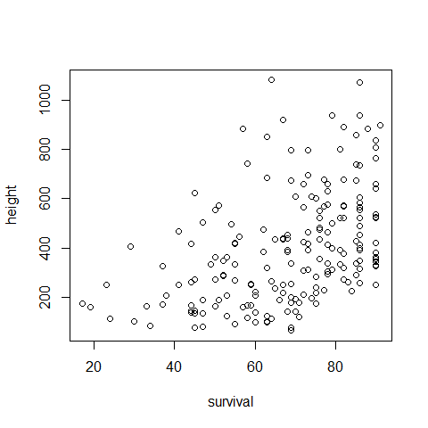<!-- -->


#### Regression


```r
fit <- lm(height ~ survival, data = williams.trees)
summary(fit)
```

```
## 
## Call:
## lm(formula = height ~ survival, data = williams.trees)
## 
## Residuals:
##     Min      1Q  Median      3Q     Max 
## -343.60 -158.94  -17.95  112.86  707.29 
## 
## Coefficients:
##             Estimate Std. Error t value Pr(>|t|)    
## (Intercept) -19.5875    61.4720  -0.319     0.75    
## survival      6.1766     0.8728   7.077 2.77e-11 ***
## ---
## Signif. codes:  0 '***' 0.001 '**' 0.01 '*' 0.05 '.' 0.1 ' ' 1
## 
## Residual standard error: 203.4 on 190 degrees of freedom
## Multiple R-squared:  0.2086,	Adjusted R-squared:  0.2044 
## F-statistic: 50.08 on 1 and 190 DF,  p-value: 2.77e-11
```

Stellene Sie sicher dass Sie diesen Output interpretieren können

Hinweis: Schauen Sie noch mal in die Vorlesungsunterlagen, wie das Output in R zu interpretieren ist!

* Wie ist der gefittete Zusammenhang? Zeigt die Regression eine Zu- oder Abnahme der abhängigen Variable bei einer Zunahme der unabhängigen Variable an?
* Wie weit ist das Konfidenzinterval für den Schätzer Effekt der erklärenden Variable (95% CI ungefähr 1.96 * Std. Error)
* Zeigt die Regression an dass der Effekt der erklärenden Variable auf die abhängige Variable signifikant ist?
* Wie gut ist die Korellation mit der erklärenden Variable (Multiple R-squared) - Hinweis: man sagt hier auch oft: wie viel Prozent der Varianz erklärt das Modell. 
* Sehen die Residuen symmetrisch aus? (schauen sie auf die Q1, Median, Q2)


Lösungen: 

* Zunahme der abhängigen Variable bei einer Zunahme der unabhängigen Variable.
* 1.96 * 0.8728, also ungefähr 2 * 0.8728 = 1.7. Das Konfidenzinterval ist also 6.2 +- 1.7 das heißt (4.5 bis 7.9). 
* ja
* das Modell erklärt circa 21 % der Varianz. 
* Der Mittelwert der Residuen eines (erfolgreich angepassten) Modells ist immer 0. Da der Median kleiner ist als 0, scheinen die Residuen leicht schief zu sein: rechtsschief! Hier noch mal überprüft:


```r
hist(residuals(fit))
```

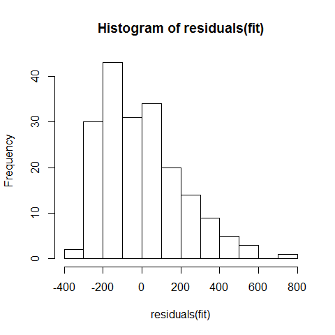<!-- -->

Wir können uns auch den Logarithmus der Likelihood des Modells anzeigen lassen


```r
logLik(fit)
```

```
## 'log Lik.' -1291.959 (df=3)
```

Man nimmt immer den logarithms weil die Zahlen sonst zu klein werden - exp(-1000) kann der Computer nicht darstellen. 

#### Visuelles Ergebnis


```r
plot(height ~ survival, data = williams.trees)
abline(fit, col = "red", lwd = 2)
```

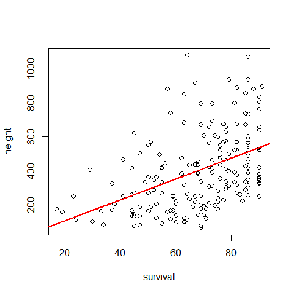<!-- -->


#### Residuen 

Nach dem Regression immer Residuen checken. 


```r
plot(residuals(fit) ~ predict(fit), data = williams.trees)
```

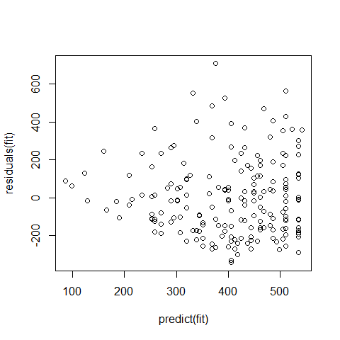<!-- -->

Problem: Varianz nimmt zu -> Varianzheterogenität. Es gibt Schlimmeres, aber für eine Publikation sollten Sie jetzt zum Statistiker Ihres Vertrauens gehen. Schauen Sie sich noch mal die verschiedenen Probleme an, die bei Residuen entstehen können.


## Mangold Blätter

siehe ?mercer.mangold.uniformity für Details

Ertrag von Blättern und Wurzeln!


#### Daten


```r
plot(roots ~ leaves, data = mercer.mangold.uniformity)
```

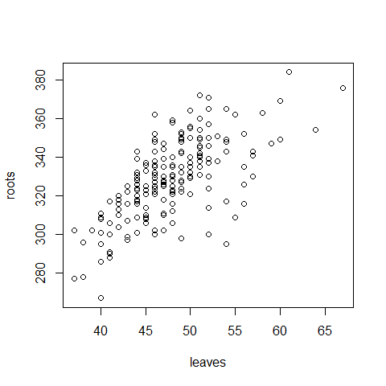<!-- -->


#### Regression


```r
fit <- lm(roots ~ leaves, data = mercer.mangold.uniformity)
summary(fit)
```

```
## 
## Call:
## lm(formula = roots ~ leaves, data = mercer.mangold.uniformity)
## 
## Residuals:
##     Min      1Q  Median      3Q     Max 
## -50.998  -8.919   0.680   9.573  38.144 
## 
## Coefficients:
##             Estimate Std. Error t value Pr(>|t|)    
## (Intercept)  196.539     10.551   18.63   <2e-16 ***
## leaves         2.768      0.220   12.58   <2e-16 ***
## ---
## Signif. codes:  0 '***' 0.001 '**' 0.01 '*' 0.05 '.' 0.1 ' ' 1
## 
## Residual standard error: 15.22 on 198 degrees of freedom
## Multiple R-squared:  0.4442,	Adjusted R-squared:  0.4414 
## F-statistic: 158.2 on 1 and 198 DF,  p-value: < 2.2e-16
```

**Versuchen Sie mit Ihrem Nachbarn, Antworten auf die folgenden Fragen zu finden (gleiches Schema wie zuvor). Sie haben 8 Minuten Zeit**

* Wie ist der gefittete Zusammenhang? Zeigt die Regression eine Zu- oder Abnahme der abhängigen Variable bei einer Zunahme der unabhängigen Variable an?
* Wie weit ist das Konfidenzinterval für den Schätzer Effekt der erklärenden Variable (95% CI ungefähr 1.96 * Std. Error)
* Zeigt die Regression an dass der Effekt der erklärenden Variable auf die abhängige Variable signifikant ist?
* Wie gut ist die Korellation mit der erklärenden Variable (Multiple R-squared) - Hinweis: man sagt hier auch oft: wie viel Prozent der Varianz erklärt das Modell.
* Sehen die Residuen symmetrisch aus? (schauen sie auf die Q1, Median, Q2)
 

#### Visuelles ergebnis


```r
plot(roots ~ leaves, data = mercer.mangold.uniformity)
abline(fit, col = "red", lwd = 2)
```

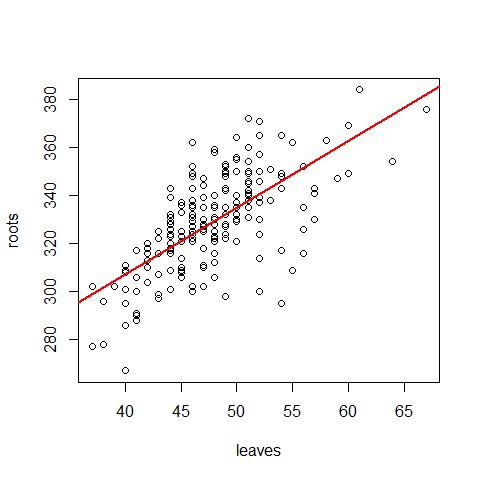<!-- -->

#### Residuen 


```r
plot(residuals(fit) ~ predict(fit), data = williams.trees)
```

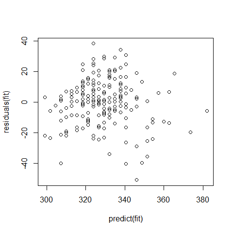<!-- -->

Sieht eigentlich OK aus ... ein bisschen scheint es so als weichen die Datepunkte in der Mitte mehr nach oben und an den Rändern mehr nach unten ab. Das könnte bedeuten dass die Beziehung nicht linear ist. 

#### Quadratischer Effekt 

Probieren wir doch mal ob es Anzeichen für einen zusätzlichen quadratischen Effekt gibt, d.h. statt des alten Modells 

roots = a0 * a1 * leaves

fitten wir jetzt 

roots = a0 * a1 * leaves + a2 * leaves^2

also eine quadratische Funktion, oder auch Polynom 2. Grades. 


```r
fit2 <- lm(roots ~ leaves + I(leaves^2), data = mercer.mangold.uniformity)
summary(fit2)
```

```
## 
## Call:
## lm(formula = roots ~ leaves + I(leaves^2), data = mercer.mangold.uniformity)
## 
## Residuals:
##     Min      1Q  Median      3Q     Max 
## -51.449  -8.508   0.672   9.817  36.662 
## 
## Coefficients:
##              Estimate Std. Error t value Pr(>|t|)    
## (Intercept) -33.54052   63.94141  -0.525 0.600485    
## leaves       12.19976    2.59622   4.699  4.9e-06 ***
## I(leaves^2)  -0.09561    0.02623  -3.645 0.000342 ***
## ---
## Signif. codes:  0 '***' 0.001 '**' 0.01 '*' 0.05 '.' 0.1 ' ' 1
## 
## Residual standard error: 14.77 on 197 degrees of freedom
## Multiple R-squared:  0.4793,	Adjusted R-squared:  0.474 
## F-statistic: 90.68 on 2 and 197 DF,  p-value: < 2.2e-16
```

Wie sie sehen ist der quadratische Term wirklich siginifikant. 

#### Visuelles ergebnis


```r
plot(roots ~ leaves, data = mercer.mangold.uniformity)
nLeave = seq(35,70, len = 100)
lines(nLeave, predict(fit2, newdata = data.frame(leaves = nLeave)), col = "red", lwd = 2)
```

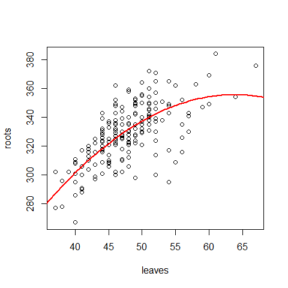<!-- -->

Wir könne auch die Likelihoods der beiden Modelle vergleichen 


```r
logLik(fit)
```

```
## 'log Lik.' -827.3551 (df=3)
```

```r
logLik(fit2)
```

```
## 'log Lik.' -820.8275 (df=4)
```

Ein Unterschied von 7 - das sieht erst mal nicht so viel aus, aber machen Sie sich klar dass das log Werte sind, d.h. die Wahrscheinlichkeit der Daten sind für Modell 2 1000x höher als für Modell 1 


```r
exp(7)
```

```
## [1] 1096.633
```

Heißt dass auch das Modell 2 1000x wahrscheinlich ist? Natürlich nicht, nach den üblichen Argumenten - die Likelihood ist die Wahrscheinlichkeit der Daten, sie können die nicht ohne weiteres umdrehen (s.o.).

Außerdem sollten Sie bedenken dass ein flexibleres Modell (mehr Parameter) immer besser an die Daten passt - d.h. die Likelihood wird nie schlechter wenn Sie einen Parameter dazunehmen, denn das alte Modell ist ja in dem neuen enthalten.

Die Daumenregel ist dass eine Verbesserung in der log Likelihood kleiner als 2 keine signifikante Evidenz für das komplizertere Modell zeigt (wir besprechen das nächste Woche noch mal genauer). Bei einem Unterschied wie hier von 7 würde man aber schon sagen dass das Modell mit dem quadratische Effekt besser ist. 


#### Residuen 


```r
plot(residuals(fit2) ~ predict(fit2), data = williams.trees)
```

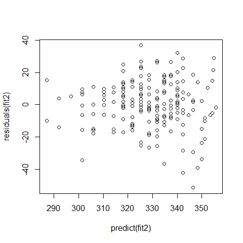<!-- -->

Jetzt sehen die Residuen deutlich stabiler aus, aber ist ist immer noch etwas Varianzinhomogenität zu bemerken ... das würden wir aber jetzt erst mal wieder akzeptieren, oder Sie müssen wieder zu Ihrem Statistiker.

## Ernte von Apfelbäumen

siehe ?pearce.apple für Details

#### Daten

Es geht um den Ernteerfolg von Apfelbäumen. Der Unterschied zu den vorherigen Datensätzen ist dass wir jetzt eine kategoriale erklärende Variable haben


```r
plot(yield ~ block, data = pearce.apple)
```

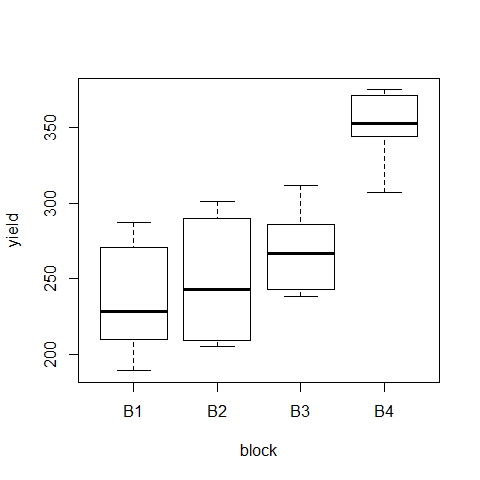<!-- -->

#### Regression mit kategorialen Prediktoren

In R gibt man die Regression völlig identisch ein, aber man muss aufpassen mit der Interpretation


```r
fit <- lm(yield ~ block, data = pearce.apple)
summary(fit)
```

```
## 
## Call:
## lm(formula = yield ~ block, data = pearce.apple)
## 
## Residuals:
##     Min      1Q  Median      3Q     Max 
## -46.500 -26.917  -1.917  25.375  52.500 
## 
## Coefficients:
##             Estimate Std. Error t value Pr(>|t|)    
## (Intercept)   235.50      14.20  16.590 3.70e-13 ***
## blockB2        13.00      20.08   0.648    0.525    
## blockB3        33.17      20.08   1.652    0.114    
## blockB4       114.83      20.08   5.720 1.35e-05 ***
## ---
## Signif. codes:  0 '***' 0.001 '**' 0.01 '*' 0.05 '.' 0.1 ' ' 1
## 
## Residual standard error: 34.77 on 20 degrees of freedom
## Multiple R-squared:  0.6643,	Adjusted R-squared:  0.614 
## F-statistic: 13.19 on 3 and 20 DF,  p-value: 5.604e-05
```

Machen Sie sich klar dass die Parameter so zu interpretieren sind

* Intercept = erste Möglichkeit des kategorialen Prediktors (hier B1)
* Die Effekte für B2, B3, B4 sind der UNTERSCHIED zu B1

* D.h. der Schätzer für B4 ergibt sich aus Intercept 235.5 + blockB4 114.8, also ungefähr 350 
* Auch die Hypothesentests sind immer im Unterschied zu Intercept, also B1.

**Stellen Sie sicher dass Sie das ordentlich interpretieren könnten.**

#### Residuen 

Bei kategorialen Variablen sollte man immer für die einzelnen Gruppen plotten


```r
plot(residuals(fit) ~ block, data = pearce.apple)
```

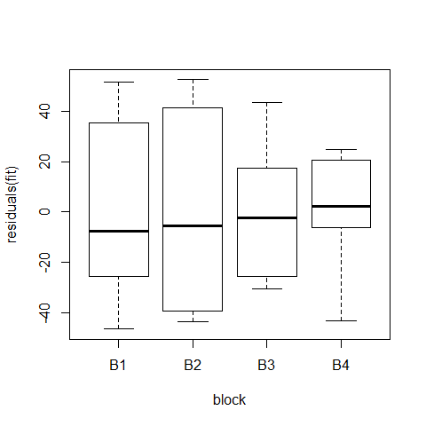<!-- -->

hmm ... naja. Der Datensatz ist halt nicht besonders groß. Die Schwankungen könnten auch Zufall sein. 

# ANOVA

Zu allerletzt wollte ich Ihnen noch was zeigen. Bei den kategorialen Prediktoren hat man ja das Problem dass der p-Wert (und der Schätzer) immer Bezug auf die erste Gruppe nimmt. Vielleicht würde man aber gerne wissen ob block überhaupt einen Effekt hat. Dafür gibt es einen speziellen und sehr bekannten Test, die ANOVA = Analysis of Variance. 

Die Nullhypothese der Anova ist: könnten die Daten aus einem Modell stammen in dem Block insgesamt keinen Effekt hat. Die Antwort bekommt man dann mit 


```r
summary(aov(fit))
```

```
##             Df Sum Sq Mean Sq F value  Pr(>F)    
## block        3  47853   15951   13.19 5.6e-05 ***
## Residuals   20  24182    1209                    
## ---
## Signif. codes:  0 '***' 0.001 '**' 0.01 '*' 0.05 '.' 0.1 ' ' 1
```

Signifikant, also nein - die ANOVA sagt uns dass es einen Effekt von Block gibt, aber nicht welcher Block sich von welchem unterscheidet. 

Also, mit der ANOVA schätzen sie die Gesamt-Signfikanz eines kategorialen Prediktors. Das zugrundeliegende statistische Modell ist identisch zu dem Modell der linearen Regression. 


# Testfragen lineare Regression


**Frage 4** Was sind die Annahmen der linearen Regression?

**Frage 5** Wie werden die Parameter in der linearen Regression bestimmt?

**Frage 6** Welche H0 steckt hinter den p-Werten der Parameter der linearen Regression?


# Antworten


**Antwort zu 1**: p(D|M,x) - in Worten: die Wahrscheinlichkeits(dichte) für D, gegeben M und x

Bemerkung: ich schreibe immer Dichte in Klammern, weil es sich mathematisch bei den Wahrscheinlichkeitsfunktionen von kontinuierlichen Daten um Dichtefunktionen handelt, d.h. die Normalverteilung ist eine Wahrscheinlichkeitsdichte.

Eine Wahrscheinlichkeit erhält man dadurch dass man eine Dichte über einen gewissen Bereich integriert. Als kleines Beispiel schauen Sie sich doch mal die uniforme Verteilung [0,1) an


```r
curve(dunif, 0,1)
```

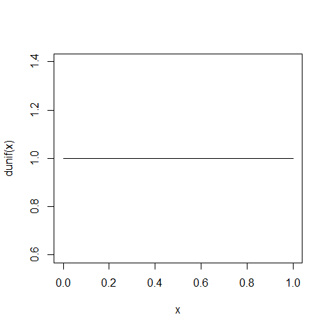<!-- -->

Auch diese ist eine Dichtefunktion. Wie Sie sehen ist die Dichte für den Wert 0.2 genau 1 - das ist aber nicht die Wahrscheinlichkeit dass der Wert 0.2 auftritt. Genaugenommen ist die Wahrscheinlichkeit dass genau 0.2 auftritt unendlich klein, weil ja alle möglichen Werte zwischen 0 und 1 auftregen können, d.h. genau 0.2 kommt unendlich selten vor. Man bekommt eine Wahrscheinlichkeit wenn man einen über einen bestimmten Bereich der Funktion integriert. Z.B ist die Wahrscheinlichkeit dass ein Wert zwischen 0.15 und 0.25 auftritt das Integral der Dichtefunktion über diesen Bereich, = 0.1.

**Antwort zu 2**: Man nimmt p(D|M,x), probiert alle möglichen Parameter aus, und nimmt den Parameter für den die Wahrscheinlichkeit der Daten am höchsten ist

**Antwort zu 3**: Nein, er ist erst mal nur der Parameter für den die Wahrscheinlichkeit der Daten am höchsten ist. Nur wenn Sie die Zusatzannahme machen dass auch alle Parameterwerte gleich wahrscheinlich sind dürften Sie sagen dass der MLE der wahrscheinlichste Parameter ist.


** zu Frage 4** Abhängige Variable beschreibbar durch Polynom der unabhängigen Variable(n) + normalverteilte Streuung.

** zu Frage 5** Man sucht den MLE für die Annnahmen der linearen Regresion. 

** zu Frage 6** H0 = Parameter ist 0.


