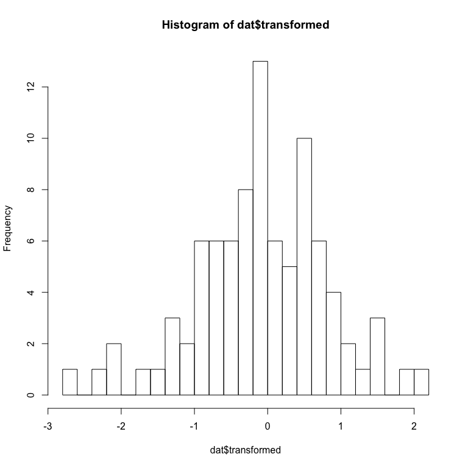

# Options to deal with continous proportions
Florian Hartig  
2/16/2017  


# Creating test data


```r
library(gamlss)
difference = 0.1
sampleSize = 50
dat<-data.frame(resp = rBEZI(100, mu=rep(c(0.5-difference/2,0.5+difference/2), each = sampleSize), sigma=5, nu=0.1), pred = as.factor(rep(c(1,2), each = sampleSize)))
boxplot(resp~pred, data = dat)
```

<!-- -->


# Fitting the data

## Kruskal-Wallis Rank Sum Test

For a categorical predictor, a simple KW test might suffice


```r
kruskal.test(resp~pred, data = dat) 
```

```
## 
## 	Kruskal-Wallis rank sum test
## 
## data:  resp by pred
## Kruskal-Wallis chi-squared = 1.8468, df = 1, p-value = 0.1742
```

## Beta-Regression

A standard regression approach is the beta-regression. The most general framework to do this in R is the gamlss package, which also permits zero-inflated beta data. 


```r
mod1<-gamlss(resp~pred,sigma.formula=~1, nu.formula=~1, family=BEZI, data = dat) 
```

```
## GAMLSS-RS iteration 1: Global Deviance = 17.1381 
## GAMLSS-RS iteration 2: Global Deviance = 15.1494 
## GAMLSS-RS iteration 3: Global Deviance = 15.1492
```

```r
summary(mod1)
```

```
## ******************************************************************
## Family:  c("BEZI", "Zero Inflated Beta") 
## 
## Call:  
## gamlss(formula = resp ~ pred, sigma.formula = ~1, nu.formula = ~1,  
##     family = BEZI, data = dat) 
## 
## Fitting method: RS() 
## 
## ------------------------------------------------------------------
## Mu link function:  logit
## Mu Coefficients:
##             Estimate Std. Error t value Pr(>|t|)  
## (Intercept)  -0.2624     0.1081  -2.427   0.0171 *
## pred2         0.3938     0.1552   2.537   0.0128 *
## ---
## Signif. codes:  0 '***' 0.001 '**' 0.01 '*' 0.05 '.' 0.1 ' ' 1
## 
## ------------------------------------------------------------------
## Sigma link function:  log
## Sigma Coefficients:
##             Estimate Std. Error t value Pr(>|t|)    
## (Intercept)   1.8632     0.1398   13.33   <2e-16 ***
## ---
## Signif. codes:  0 '***' 0.001 '**' 0.01 '*' 0.05 '.' 0.1 ' ' 1
## 
## ------------------------------------------------------------------
## Nu link function:  logit 
## Nu Coefficients:
##             Estimate Std. Error t value Pr(>|t|)    
## (Intercept)  -2.0907     0.3196  -6.542 2.96e-09 ***
## ---
## Signif. codes:  0 '***' 0.001 '**' 0.01 '*' 0.05 '.' 0.1 ' ' 1
## 
## ------------------------------------------------------------------
## No. of observations in the fit:  100 
## Degrees of Freedom for the fit:  4
##       Residual Deg. of Freedom:  96 
##                       at cycle:  3 
##  
## Global Deviance:     15.14923 
##             AIC:     23.14923 
##             SBC:     33.56991 
## ******************************************************************
```

maybe also with GLMMTMT http://stats.stackexchange.com/questions/233366/how-to-fit-binomial-glmm-with-continuous-response-between-0-and-1-that-is-not-a

## Transformation

Idea is to apply a transformation to map the data onto -inf, inf, and apply a normal linear regression / ANOVA. Warton, D. I. & Hui, F. K. C. The arcsine is asinine: the analysis of proportions in ecology Ecology, Ecology, 2010, 92, 3-10 recommend the logit transformation, although they do not that there is not general rule and any transformation that would make residuals normal is permissible. 


```r
dat$transformed = qlogis(dat$resp)
hist(dat$transformed, breaks = 20)
```

<!-- -->

The hist looks great, but note that we had zeros in the data, which were removed here because they are mappped to -Inf. If there are zero / ones present, one can shrink the borders a bit to avoid the -Inf for zero, but if there are lots of zeros, the zero-peak will still be visible


```r
eps = 0.03
dat$transformed = qlogis(dat$resp / (1 + 2*eps) + eps)
hist(dat$transformed, breaks = 20)
```

<!-- -->

OK, so this doesn't look so great but let's do the model anyay


```r
mod2<-lm(transformed~pred, data = dat) 
summary(mod2)
```

```
## 
## Call:
## lm(formula = transformed ~ pred, data = dat)
## 
## Residuals:
##     Min      1Q  Median      3Q     Max 
## -3.1185 -0.3635  0.2303  0.8485  2.3006 
## 
## Coefficients:
##             Estimate Std. Error t value Pr(>|t|)   
## (Intercept)  -0.5275     0.1875  -2.812  0.00594 **
## pred2         0.1699     0.2652   0.641  0.52332   
## ---
## Signif. codes:  0 '***' 0.001 '**' 0.01 '*' 0.05 '.' 0.1 ' ' 1
## 
## Residual standard error: 1.326 on 98 degrees of freedom
## Multiple R-squared:  0.004169,	Adjusted R-squared:  -0.005993 
## F-statistic: 0.4103 on 1 and 98 DF,  p-value: 0.5233
```


## Quantile regression 

This is a somewhat exotic option, although it has been applied in a few papers: quantile regression makes no particular distributional assumptions, so it should also work well on proportional data. We use


```r
require(quantreg)
mod3 <- rq(resp~pred, data = dat)
```

```
## Warning in rq.fit.br(x, y, tau = tau, ...): Solution may be nonunique
```

```r
summary(mod3, se = "boot")
```

```
## 
## Call: rq(formula = resp ~ pred, data = dat)
## 
## tau: [1] 0.5
## 
## Coefficients:
##             Value    Std. Error t value  Pr(>|t|)
## (Intercept)  0.40194  0.03603   11.15624  0.00000
## pred2        0.08929  0.05005    1.78429  0.07747
```

## Quasi-Binomial / "pseudo-binomial"

Another technique is the idea of fitting a "pseudo-binomial" model, see 

* http://stats.stackexchange.com/questions/233366/how-to-fit-binomial-glmm-with-continuous-response-between-0-and-1-that-is-not-a

* http://stats.stackexchange.com/questions/233366/how-to-fit-binomial-glmm-with-continuous-response-between-0-and-1-that-is-not-a

* https://support.sas.com/documentation/cdl/en/statug/63033/HTML/default/viewer.htm#statug_glimmix_sect016.htm

* http://stats.stackexchange.com/questions/91724/what-is-quasi-binomial-distribution-in-the-context-of-glm

Why this works is still not 100% clear to me - in the glm, we can specify proportions, such as 0.2, 0.3, but then we have to provide weights (10, 20), which are then the number of trials. It seems the quasi-binomial allows 0.2 etc responses also with weights all equal to 1. 

I saw remarks that the power of this model is similar to the logit transformation with lm ... in my simulations, I seemed more like lower Power, but this would have to be tested more thoroghly. Advantage is that zeros are no problem. Disadvantage is that residuals are difficult to check. 


```r
mod4 = glm(resp~pred, data = dat, family = quasibinomial)
summary(mod4)
```

```
## 
## Call:
## glm(formula = resp ~ pred, family = quasibinomial, data = dat)
## 
## Deviance Residuals: 
##      Min        1Q    Median        3Q       Max  
## -1.10762  -0.26446   0.01429   0.33567   0.92438  
## 
## Coefficients:
##             Estimate Std. Error t value Pr(>|t|)   
## (Intercept)  -0.3920     0.1357  -2.888  0.00477 **
## pred2         0.2256     0.1904   1.185  0.23903   
## ---
## Signif. codes:  0 '***' 0.001 '**' 0.01 '*' 0.05 '.' 0.1 ' ' 1
## 
## (Dispersion parameter for quasibinomial family taken to be 0.2215739)
## 
##     Null deviance: 26.800  on 99  degrees of freedom
## Residual deviance: 26.489  on 98  degrees of freedom
## AIC: NA
## 
## Number of Fisher Scoring iterations: 3
```


