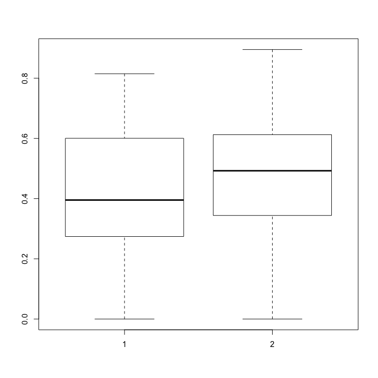
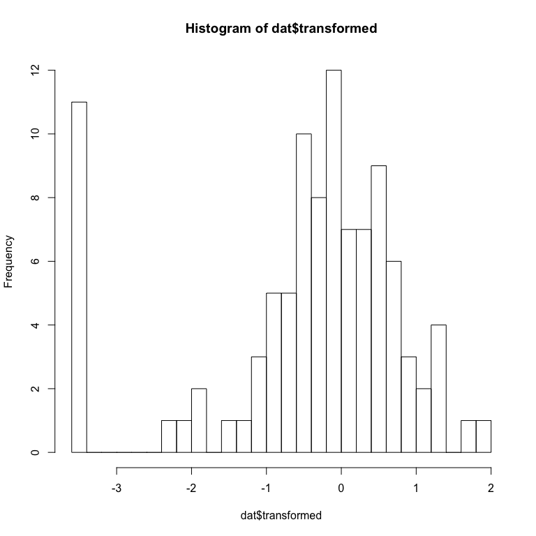
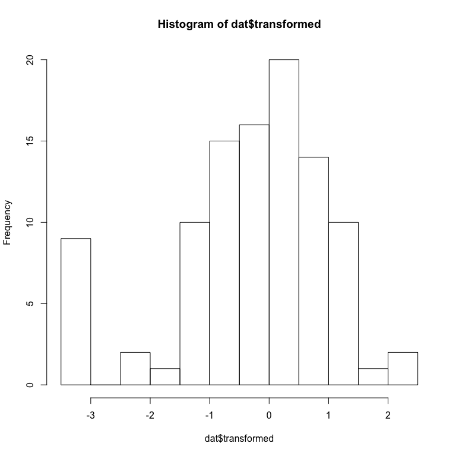

# Options to analyze continous proportions
Florian Hartig  
2/16/2017  


# Creating test data


```r
library(gamlss)
difference = 0.1
sampleSize = 50
dat<-data.frame(resp = rBEZI(100, mu=rep(c(0.5-difference/2,0.5+difference/2), each = sampleSize), sigma=5, nu=0.1), pred = as.factor(rep(c(1,2), each = sampleSize)))
boxplot(resp~pred, data = dat)
```

<!-- -->

The issue with continous proportions is that they are continous obviously, so we would like to use a continous distribution, but they are also bound between 0 and 1, which limits our options quite considerably. 

# Options to fit the data

Here, a list of options to fit the data. There is no clear best choice, either of the options makes slighly different assumptions about the residuals.

## Kruskal-Wallis Rank Sum Test

In experimental settings with a single categorical predictor, a simple KW test might suffice


```r
kruskal.test(resp~pred, data = dat) 
```

```
## 
## 	Kruskal-Wallis rank sum test
## 
## data:  resp by pred
## Kruskal-Wallis chi-squared = 1.2791, df = 1, p-value = 0.2581
```

Although some sources suggest that this is less powerfull than regression-alternatives, I didn't see major losses of power when playing with this informally. 


## GLM, logit link, Gaussian response

A second choice is to fit a gaussian glm with a logit link. The idea is to stretch out the data towards the 0/1 borders, so that residuals become more symmetric. This streching idea, however, is dangerous. Firstly, this distribution cannot deal with zeros or ones. Because there are zeros and ones in our data, I have shrunk the data by 0.01 inside [0.01,0.99]. But even so, if there are many zeros and ones, the distributional assumptions are easily violated. Use this with care


## Beta-Regression

A standard regression approach is the beta-regression. The most general framework to do this in R is the gamlss package, which also permits zero-inflated beta data. 


```r
mod1<-gamlss(resp~pred,sigma.formula=~1, nu.formula=~1, family=BEZI, data = dat) 
```

```
## GAMLSS-RS iteration 1: Global Deviance = 25.8278 
## GAMLSS-RS iteration 2: Global Deviance = 25.4306 
## GAMLSS-RS iteration 3: Global Deviance = 25.4306
```

```r
summary(mod1)
```

```
## ******************************************************************
## Family:  c("BEZI", "Zero Inflated Beta") 
## 
## Call:  
## gamlss(formula = resp ~ pred, sigma.formula = ~1, nu.formula = ~1,  
##     family = BEZI, data = dat) 
## 
## Fitting method: RS() 
## 
## ------------------------------------------------------------------
## Mu link function:  logit
## Mu Coefficients:
##             Estimate Std. Error t value Pr(>|t|)
## (Intercept)  -0.1181     0.1219  -0.969    0.335
## pred2         0.2154     0.1715   1.257    0.212
## 
## ------------------------------------------------------------------
## Sigma link function:  log
## Sigma Coefficients:
##             Estimate Std. Error t value Pr(>|t|)    
## (Intercept)   1.5824     0.1355   11.68   <2e-16 ***
## ---
## Signif. codes:  0 '***' 0.001 '**' 0.01 '*' 0.05 '.' 0.1 ' ' 1
## 
## ------------------------------------------------------------------
## Nu link function:  logit 
## Nu Coefficients:
##             Estimate Std. Error t value Pr(>|t|)    
## (Intercept)  -2.3136     0.3494  -6.621 2.05e-09 ***
## ---
## Signif. codes:  0 '***' 0.001 '**' 0.01 '*' 0.05 '.' 0.1 ' ' 1
## 
## ------------------------------------------------------------------
## No. of observations in the fit:  100 
## Degrees of Freedom for the fit:  4
##       Residual Deg. of Freedom:  96 
##                       at cycle:  3 
##  
## Global Deviance:     25.4306 
##             AIC:     33.4306 
##             SBC:     43.85128 
## ******************************************************************
```

maybe also with GLMMTMT http://stats.stackexchange.com/questions/233366/how-to-fit-binomial-glmm-with-continuous-response-between-0-and-1-that-is-not-a

## Transformation

Idea is to apply a transformation to map the data onto -inf, inf, and apply a normal linear regression / ANOVA. Warton, D. I. & Hui, F. K. C. The arcsine is asinine: the analysis of proportions in ecology Ecology, Ecology, 2010, 92, 3-10 recommend the logit transformation, although they do not that there is not general rule and any transformation that would make residuals normal is permissible. I have seen other papers discourage it, especially when there are observations close to 0 and 1. 


```r
dat$transformed = qlogis(dat$resp)
hist(dat$transformed, breaks = 20)
```

<!-- -->

The hist looks great, but note that we had zeros in the data, which were removed here because they are mappped to -Inf. If there are zero / ones present, one can shrink the borders a bit to avoid the -Inf for zero, but if there are lots of zeros, the zero-peak will still be visible


```r
eps = 0.03
dat$transformed = qlogis(dat$resp / (1 + 2*eps) + eps)
hist(dat$transformed, breaks = 20)
```

<!-- -->

OK, so this doesn't look so great but let's do the model anyay


```r
mod2<-lm(transformed~pred, data = dat) 
summary(mod2)
```

```
## 
## Call:
## lm(formula = transformed ~ pred, data = dat)
## 
## Residuals:
##     Min      1Q  Median      3Q     Max 
## -3.3065 -0.5771  0.2342  0.8450  2.4102 
## 
## Coefficients:
##             Estimate Std. Error t value Pr(>|t|)  
## (Intercept)  -0.4576     0.1887  -2.425   0.0171 *
## pred2         0.2880     0.2668   1.079   0.2831  
## ---
## Signif. codes:  0 '***' 0.001 '**' 0.01 '*' 0.05 '.' 0.1 ' ' 1
## 
## Residual standard error: 1.334 on 98 degrees of freedom
## Multiple R-squared:  0.01175,	Adjusted R-squared:  0.001664 
## F-statistic: 1.165 on 1 and 98 DF,  p-value: 0.2831
```

A faster way to do the procedure is to use a glm with logit link and gaussian distribution 


```r
mod0 = glm(resp+0.01/0.98~pred, data = dat, family = gaussian(link = "logit")) 
summary(mod0)
```

```
## 
## Call:
## glm(formula = resp + 0.01/0.98 ~ pred, family = gaussian(link = "logit"), 
##     data = dat)
## 
## Deviance Residuals: 
##      Min        1Q    Median        3Q       Max  
## -0.48219  -0.17726   0.02393   0.17852   0.44407  
## 
## Coefficients:
##             Estimate Std. Error t value Pr(>|t|)  
## (Intercept)  -0.2633     0.1419  -1.855   0.0666 .
## pred2         0.2329     0.1990   1.170   0.2448  
## ---
## Signif. codes:  0 '***' 0.001 '**' 0.01 '*' 0.05 '.' 0.1 ' ' 1
## 
## (Dispersion parameter for gaussian family taken to be 0.06080773)
## 
##     Null deviance: 6.0428  on 99  degrees of freedom
## Residual deviance: 5.9592  on 98  degrees of freedom
## AIC: 7.7636
## 
## Number of Fisher Scoring iterations: 4
```


## Quantile regression 

This is a somewhat exotic option, although it has been applied in a few papers: quantile regression makes no particular distributional assumptions, so it should also work well on proportional data. We use


```r
require(quantreg)
mod3 <- rq(resp~pred, data = dat)
```

```
## Warning in rq.fit.br(x, y, tau = tau, ...): Solution may be nonunique
```

```r
summary(mod3, se = "boot")
```

```
## 
## Call: rq(formula = resp ~ pred, data = dat)
## 
## tau: [1] 0.5
## 
## Coefficients:
##             Value   Std. Error t value Pr(>|t|)
## (Intercept) 0.45362 0.05221    8.68850 0.00000 
## pred2       0.04717 0.07124    0.66211 0.50945
```

## Quasi-Binomial / "pseudo-binomial"

Another technique is the idea of fitting a "pseudo-binomial" model, see 

* http://stats.stackexchange.com/questions/233366/how-to-fit-binomial-glmm-with-continuous-response-between-0-and-1-that-is-not-a

* http://stats.stackexchange.com/questions/233366/how-to-fit-binomial-glmm-with-continuous-response-between-0-and-1-that-is-not-a

* https://support.sas.com/documentation/cdl/en/statug/63033/HTML/default/viewer.htm#statug_glimmix_sect016.htm

* http://stats.stackexchange.com/questions/91724/what-is-quasi-binomial-distribution-in-the-context-of-glm

Why this works is a bit mysterious. In the glm, we can specify proportions, such as 0.2, 0.3, but then we have to provide weights (10, 20), which are then the number of trials. It seems the quasi-binomial allows 0.2 etc responses also with weights all equal to 1, because the weights are the essentially fitted. 

I saw remarks that the power of this model is similar to the logit transformation with lm ... in my simulations, I seemed more like lower Power, but this would have to be tested more thoroghly. Advantage is that zeros are no problem. Disadvantage is that residuals are difficult to check. 


```r
mod4 = glm(resp~pred, data = dat, family = quasibinomial)
summary(mod4)
```

```
## 
## Call:
## glm(formula = resp ~ pred, family = quasibinomial, data = dat)
## 
## Deviance Residuals: 
##      Min        1Q    Median        3Q       Max  
## -1.14731  -0.36749   0.04813   0.35890   0.96016  
## 
## Coefficients:
##             Estimate Std. Error t value Pr(>|t|)  
## (Intercept)  -0.3050     0.1419  -2.149   0.0341 *
## pred2         0.2337     0.1996   1.171   0.2445  
## ---
## Signif. codes:  0 '***' 0.001 '**' 0.01 '*' 0.05 '.' 0.1 ' ' 1
## 
## (Dispersion parameter for quasibinomial family taken to be 0.2459811)
## 
##     Null deviance: 28.945  on 99  degrees of freedom
## Residual deviance: 28.607  on 98  degrees of freedom
## AIC: NA
## 
## Number of Fisher Scoring iterations: 3
```


