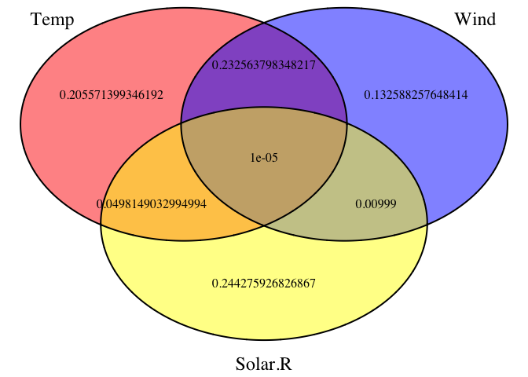

# The problem

We have a regression of the form: 

Y ~ x1 + x2

We want to know how important x1 and x2 for explaining the signal in y. By important, we mean (in principle R2), i.e. the reduction in R2. Let's look at this example that all of you probably know


```r
m = lm(Ozone ~ Wind + Temp , data = airquality)
summary(m)
```

```
## 
## Call:
## lm(formula = Ozone ~ Wind + Temp, data = airquality)
## 
## Residuals:
##     Min      1Q  Median      3Q     Max 
## -41.251 -13.695  -2.856  11.390 100.367 
## 
## Coefficients:
##             Estimate Std. Error t value Pr(>|t|)    
## (Intercept) -71.0332    23.5780  -3.013   0.0032 ** 
## Wind         -3.0555     0.6633  -4.607 1.08e-05 ***
## Temp          1.8402     0.2500   7.362 3.15e-11 ***
## ---
## Signif. codes:  0 '***' 0.001 '**' 0.01 '*' 0.05 '.' 0.1 ' ' 1
## 
## Residual standard error: 21.85 on 113 degrees of freedom
##   (37 observations deleted due to missingness)
## Multiple R-squared:  0.5687,	Adjusted R-squared:  0.5611 
## F-statistic:  74.5 on 2 and 113 DF,  p-value: < 2.2e-16
```

Note that we can read off the R2 in the regression table (+ adjusted R2, more on that later). The standard ANOVA (type I) is doing this by adding one variable after the other, and measuring how much the explained R2 is being reduced


```r
anova(m)
```

```
## Analysis of Variance Table
## 
## Response: Ozone
##            Df Sum Sq Mean Sq F value    Pr(>F)    
## Wind        1  45284   45284  94.808 < 2.2e-16 ***
## Temp        1  25886   25886  54.196 3.149e-11 ***
## Residuals 113  53973     478                      
## ---
## Signif. codes:  0 '***' 0.001 '**' 0.01 '*' 0.05 '.' 0.1 ' ' 1
```

## Anova vs. other option to partition variance 

For numeric predictors ANOVA will be similar to effect sizes with scaled predictors IF predictors are balanced and uniformly distributed


```r
m = lm(Ozone ~ scale(Wind) + scale(Temp) , data = airquality)
summary(m)
```

```
## 
## Call:
## lm(formula = Ozone ~ scale(Wind) + scale(Temp), data = airquality)
## 
## Residuals:
##     Min      1Q  Median      3Q     Max 
## -41.251 -13.695  -2.856  11.390 100.367 
## 
## Coefficients:
##             Estimate Std. Error t value Pr(>|t|)    
## (Intercept)   41.859      2.030  20.618  < 2e-16 ***
## scale(Wind)  -10.764      2.337  -4.607 1.08e-05 ***
## scale(Temp)   17.418      2.366   7.362 3.15e-11 ***
## ---
## Signif. codes:  0 '***' 0.001 '**' 0.01 '*' 0.05 '.' 0.1 ' ' 1
## 
## Residual standard error: 21.85 on 113 degrees of freedom
##   (37 observations deleted due to missingness)
## Multiple R-squared:  0.5687,	Adjusted R-squared:  0.5611 
## F-statistic:  74.5 on 2 and 113 DF,  p-value: < 2.2e-16
```

For categorical predictors, ANOVA will be similar to random effect variances IF data is balanced 


```r
m = lm(Ozone ~ as.factor(Month) + as.factor(Day) , data = airquality)
anova(m)
```

```
## Analysis of Variance Table
## 
## Response: Ozone
##                  Df Sum Sq Mean Sq F value    Pr(>F)    
## as.factor(Month)  4  29438  7359.5  9.9897 1.272e-06 ***
## as.factor(Day)   30  36032  1201.1  1.6303   0.04357 *  
## Residuals        81  59673   736.7                      
## ---
## Signif. codes:  0 '***' 0.001 '**' 0.01 '*' 0.05 '.' 0.1 ' ' 1
```

```r
library(lme4)
```

```
## Loading required package: Matrix
```

```r
m = lmer(Ozone ~ (1|Month) + (1|Day) , data = airquality)
summary(m)
```

```
## Linear mixed model fit by REML ['lmerMod']
## Formula: Ozone ~ (1 | Month) + (1 | Day)
##    Data: airquality
## 
## REML criterion at convergence: 1113.2
## 
## Scaled residuals: 
##     Min      1Q  Median      3Q     Max 
## -1.8025 -0.6219 -0.1892  0.4373  3.4521 
## 
## Random effects:
##  Groups   Name        Variance Std.Dev.
##  Day      (Intercept) 136.1    11.67   
##  Month    (Intercept) 257.6    16.05   
##  Residual             728.0    26.98   
## Number of obs: 116, groups:  Day, 31; Month, 5
## 
## Fixed effects:
##             Estimate Std. Error t value
## (Intercept)   41.353      7.976   5.185
```

To use the random effects like this is called **variance component analysis**, see 

* Designs for Variance Components Estimation: Past and Present https://sci-hub.tw/https://doi.org/10.1111/j.1751-5823.2000.tb00333.x
* Analysis of variance (ANOVA) and estimation of variance components http://www.fao.org/3/y4391e/y4391e07.htm
* R-Package VCA for Variance Component Analysis

From the Vignette of the VCA package: 

VCA are a way to assess how the variability of a dependent variable is structured taking into account its association with one or multiple random-effects variables. Proportions of the total variability found to be attributed to these random effects variables are called variance components (VC). Thus, VCA is the procedure of estimating the amount of the VCs’ contribution to the total variability in the dependent variable. Moreover, there are methods provided for estimating confidence intervals (CI) of VCs along with different graphical tools to better understand the data and for detecting outliers. Also included, but usually of less importance in the field of VCA: Estimation of fixed effects and least square means (LS means) as well as testing linear hypotheses of fixed effects/LS means of linear mixed models (LMMs).

## Shared components and interactions


Problem of that: if we turn it around, we get another result, because there is collinearity in the variables  


```r
m = lm(Ozone ~ Temp + Wind , data = airquality)
anova(m)
```

```
## Analysis of Variance Table
## 
## Response: Ozone
##            Df Sum Sq Mean Sq F value    Pr(>F)    
## Temp        1  61033   61033 127.781 < 2.2e-16 ***
## Wind        1  10137   10137  21.223  1.08e-05 ***
## Residuals 113  53973     478                      
## ---
## Signif. codes:  0 '***' 0.001 '**' 0.01 '*' 0.05 '.' 0.1 ' ' 1
```


## Commonality analysis

To calculate the differences is known as Commonality Analysis

* Ray‐Mukherjee, Jayanti, Kim Nimon, Shomen Mukherjee, Douglas W. Morris, Rob Slotow, and Michelle Hamer. 2014. “Using Commonality Analysis in Multiple Regressions: A Tool to Decompose Regression Effects in the Face of Multicollinearity.” Methods in Ecology and Evolution 5 (4): 320–28. https://doi.org/10.1111/2041-210X.12166.
* Seibold, David R., and Robert D. McPhee. 1979. “Commonality Analysis: A Method for Decomposing Explained Variance in Multiple Regression Analyses.” Human Communication Research 5 (4): 355–65. https://doi.org/10.1111/j.1468-2958.1979.tb00649.x.


```r
library(yhat)

## All-possible-subsets regression
apsOut=aps(airquality,"Ozone",list("Temp", "Wind","Solar.R"))

## Commonality analysis
x = commonality(apsOut)
x
```

```
##                    Coefficient      % Total
## Temp               0.156401005  0.258132363
## Wind               0.095577862  0.157746680
## Solar.R            0.024516636  0.040463532
## Temp,Wind          0.232573798  0.383851908
## Temp,Solar.R       0.049824903  0.082233615
## Wind,Solar.R      -0.002159998 -0.003564974
## Temp,Wind,Solar.R  0.049160394  0.081136875
```

Note the negative shared components. Happens sometimes, always a point of discussoin. 

It's also common to visualize this via Venn diagrams. Note I had to change the negative values so that it's possible to draw this


```r
library(VennDiagram)
```

```
## Loading required package: grid
```

```
## Loading required package: futile.logger
```

```r
venn.plot <- draw.triple.venn(sum(x[c(1,4,5,7),1]), 
                                sum(x[c(2,4,6,7),1]), 
                                sum(x[c(3,4,6,7),1]), 
                                x[4,1], 0.01, x[5,1], 0.00001,
                                c("Temp", "Wind", "Solar.R"), fill = c("red", "blue", "yellow"), cat.cex = 1.5, cat.dist = 0.05);
```

<!-- -->

```r
grid.newpage();
grid.draw(venn.plot);
```

<!-- -->

This is identical to what is done in variation partitioning in community analysis, only that here the model is different - we are not using a simple regression, but somethingl like an RDA, see 

* https://mb3is.megx.net/gustame/constrained-analyses/variation-partitioning
* https://academic.oup.com/jpe/article/1/1/3/1130269 (Legendre, looks good)
* https://sci-hub.tw/10.1658/1100-9233(2003)014[0693:ptviap]2.0.co;2


## Type I, II, III Anova

Type I, II, III Anova is basically about how to distribute the shared components. 

Type I SS is sequential, main effects first:
SS(A)
SS(B|A)
SS(A*B|A,B)

Type II SS is conditional on main effects, and sequential for interactions - note that SS don't add up to 1:
SS(A|B)
SS(B|A)
SS(A*B|A,B)

Type III SS is conditional on main effects and interactions:
SS(A|B,A*B)
SS(B|A,A*B)
SS(A*B|A,B)

Thus, type III SS tell you how much of the residual variability in Y can be accounted for by A after having accounted for everything else, and how much of the residual variability in Y can be accounted for by B after having accounted for everything else as well, and so on. (Note that both go both first and last simultaneously; if this makes sense to you, and accurately reflects your research question, then use type III SS.)

Hector, Andy, Stefanie Von Felten, and Bernhard Schmid. 2010. “Analysis of Variance with Unbalanced Data: An Update for Ecology & Evolution.” Journal of Animal Ecology 79 (2): 308–16. https://doi.org/10.1111/j.1365-2656.2009.01634.x.


```r
m = lm(Ozone ~ Wind * Temp , data = airquality)
summary(m)
```

```
## 
## Call:
## lm(formula = Ozone ~ Wind * Temp, data = airquality)
## 
## Residuals:
##     Min      1Q  Median      3Q     Max 
## -39.906 -13.048  -2.263   8.726  99.306 
## 
## Coefficients:
##               Estimate Std. Error t value Pr(>|t|)    
## (Intercept) -248.51530   48.14038  -5.162 1.07e-06 ***
## Wind          14.33503    4.23874   3.382 0.000992 ***
## Temp           4.07575    0.58754   6.937 2.73e-10 ***
## Wind:Temp     -0.22391    0.05399  -4.147 6.57e-05 ***
## ---
## Signif. codes:  0 '***' 0.001 '**' 0.01 '*' 0.05 '.' 0.1 ' ' 1
## 
## Residual standard error: 20.44 on 112 degrees of freedom
##   (37 observations deleted due to missingness)
## Multiple R-squared:  0.6261,	Adjusted R-squared:  0.6161 
## F-statistic: 62.52 on 3 and 112 DF,  p-value: < 2.2e-16
```

```r
anova(m)
```

```
## Analysis of Variance Table
## 
## Response: Ozone
##            Df Sum Sq Mean Sq F value    Pr(>F)    
## Wind        1  45284   45284 108.401 < 2.2e-16 ***
## Temp        1  25886   25886  61.966 2.421e-12 ***
## Wind:Temp   1   7186    7186  17.201 6.569e-05 ***
## Residuals 112  46787     418                      
## ---
## Signif. codes:  0 '***' 0.001 '**' 0.01 '*' 0.05 '.' 0.1 ' ' 1
```

```r
library(car)
```

```
## Loading required package: carData
```

```
## Registered S3 methods overwritten by 'car':
##   method                          from
##   influence.merMod                lme4
##   cooks.distance.influence.merMod lme4
##   dfbeta.influence.merMod         lme4
##   dfbetas.influence.merMod        lme4
```

```
## 
## Attaching package: 'car'
```

```
## The following object is masked from 'package:VennDiagram':
## 
##     ellipse
```

```r
Anova(m, type = 2)
```

```
## Anova Table (Type II tests)
## 
## Response: Ozone
##           Sum Sq  Df F value    Pr(>F)    
## Wind       10137   1  24.266 2.921e-06 ***
## Temp       25886   1  61.966 2.421e-12 ***
## Wind:Temp   7186   1  17.201 6.569e-05 ***
## Residuals  46787 112                      
## ---
## Signif. codes:  0 '***' 0.001 '**' 0.01 '*' 0.05 '.' 0.1 ' ' 1
```

```r
Anova(m, type = 3)
```

```
## Anova Table (Type III tests)
## 
## Response: Ozone
##             Sum Sq  Df F value    Pr(>F)    
## (Intercept)  11133   1  26.649 1.068e-06 ***
## Wind          4778   1  11.437 0.0009921 ***
## Temp         20103   1  48.122 2.728e-10 ***
## Wind:Temp     7186   1  17.201 6.569e-05 ***
## Residuals    46787 112                      
## ---
## Signif. codes:  0 '***' 0.001 '**' 0.01 '*' 0.05 '.' 0.1 ' ' 1
```


## Adjusting for complexity 

One issue that has been discussed on the VP literature is how to adjust for complexity. The basic question is - should we use raw or adjusted R2 for the VP, see Pedro’s paper https://doi.org/10.1890/0012-9658(2006)87[2614:VPOSDM]2.0.CO;2

There are various discussions about whether VP works in practice, although it's often a bit dubious what exatly the problem is  https://besjournals.onlinelibrary.wiley.com/doi/full/10.1111/j.1365-2664.2010.01861.x

# Simulations 


```r
# Balanced design 

n = 10000

f2 = runif(10)
f1 = runif(10)

x1 = sample.int(10, n, prob = rep(1,10), replace = T)
x2 = sample.int(10, n, prob = rep(1,10), replace = T)

e1 = 1
e2 = 1

y = rnorm(n, mean = e1 *f1[x1] + e2 * f2[x2], sd = 0.3)

dat = data.frame(y = y, x1 = factor(x1), x2 = factor(x2))

m1 = lm(y ~ x1 * x2, data = dat)
summary(m1)
```

```
## 
## Call:
## lm(formula = y ~ x1 * x2, data = dat)
## 
## Residuals:
##      Min       1Q   Median       3Q      Max 
## -1.34496 -0.20451 -0.00211  0.20238  1.38453 
## 
## Coefficients:
##               Estimate Std. Error t value Pr(>|t|)    
## (Intercept)  1.3569558  0.0294684  46.048  < 2e-16 ***
## x12         -0.3466440  0.0405005  -8.559  < 2e-16 ***
## x13         -0.7434137  0.0407505 -18.243  < 2e-16 ***
## x14         -0.3275717  0.0393374  -8.327  < 2e-16 ***
## x15         -0.5138632  0.0405826 -12.662  < 2e-16 ***
## x16         -0.4870048  0.0430122 -11.322  < 2e-16 ***
## x17         -0.7038073  0.0402616 -17.481  < 2e-16 ***
## x18         -0.1394938  0.0405005  -3.444 0.000575 ***
## x19         -0.1279011  0.0424199  -3.015 0.002575 ** 
## x110        -0.3654516  0.0414776  -8.811  < 2e-16 ***
## x22         -0.3274718  0.0420894  -7.780 7.95e-15 ***
## x23          0.1567581  0.0413815   3.788 0.000153 ***
## x24         -0.1003053  0.0426503  -2.352 0.018702 *  
## x25          0.1221787  0.0433951   2.815 0.004880 ** 
## x26          0.0083545  0.0439419   0.190 0.849214    
## x27          0.1738350  0.0439419   3.956 7.67e-05 ***
## x28         -0.4651368  0.0413815 -11.240  < 2e-16 ***
## x29          0.0555695  0.0421976   1.317 0.187907    
## x210         0.2616417  0.0407505   6.421 1.42e-10 ***
## x12:x22      0.0260964  0.0582702   0.448 0.654270    
## x13:x22     -0.1103200  0.0591987  -1.864 0.062414 .  
## x14:x22     -0.0683810  0.0576103  -1.187 0.235273    
## x15:x22     -0.0169968  0.0585397  -0.290 0.771557    
## x16:x22     -0.0080882  0.0605427  -0.134 0.893725    
## x17:x22     -0.0191709  0.0584662  -0.328 0.742997    
## x18:x22     -0.0205482  0.0582702  -0.353 0.724369    
## x19:x22     -0.0273568  0.0614632  -0.445 0.656263    
## x110:x22    -0.0482557  0.0607126  -0.795 0.426736    
## x12:x23     -0.0365637  0.0591530  -0.618 0.536510    
## x13:x23     -0.0517177  0.0575414  -0.899 0.368785    
## x14:x23     -0.0004283  0.0572441  -0.007 0.994030    
## x15:x23     -0.0095886  0.0582590  -0.165 0.869273    
## x16:x23     -0.0058542  0.0614995  -0.095 0.924165    
## x17:x23      0.0021948  0.0576642   0.038 0.969640    
## x18:x23      0.0495910  0.0579027   0.856 0.391767    
## x19:x23      0.0239932  0.0607753   0.395 0.693010    
## x110:x23     0.0272338  0.0588860   0.462 0.643745    
## x12:x24     -0.0870327  0.0611077  -1.424 0.154405    
## x13:x24     -0.0781780  0.0598529  -1.306 0.191525    
## x14:x24     -0.1076388  0.0574222  -1.875 0.060889 .  
## x15:x24     -0.0646996  0.0590171  -1.096 0.272981    
## x16:x24     -0.0123294  0.0618626  -0.199 0.842029    
## x17:x24     -0.0417728  0.0581207  -0.719 0.472328    
## x18:x24     -0.0439727  0.0598615  -0.735 0.462617    
## x19:x24     -0.0760234  0.0602240  -1.262 0.206854    
## x110:x24    -0.0419388  0.0595640  -0.704 0.481390    
## x12:x25     -0.0684783  0.0598840  -1.144 0.252852    
## x13:x25     -0.1192315  0.0614551  -1.940 0.052391 .  
## x14:x25     -0.1028171  0.0584310  -1.760 0.078501 .  
## x15:x25     -0.0911119  0.0590145  -1.544 0.122647    
## x16:x25     -0.0251208  0.0609002  -0.412 0.679988    
## x17:x25     -0.0812824  0.0595650  -1.365 0.172410    
## x18:x25     -0.0381479  0.0582176  -0.655 0.512313    
## x19:x25     -0.0339926  0.0622631  -0.546 0.585112    
## x110:x25    -0.0284382  0.0598263  -0.475 0.634551    
## x12:x26     -0.0810201  0.0591186  -1.370 0.170572    
## x13:x26     -0.0963387  0.0599291  -1.608 0.107967    
## x14:x26     -0.0539413  0.0596707  -0.904 0.366026    
## x15:x26     -0.0149126  0.0610262  -0.244 0.806953    
## x16:x26     -0.0049305  0.0620750  -0.079 0.936694    
## x17:x26     -0.0506108  0.0601211  -0.842 0.399913    
## x18:x26     -0.0320205  0.0605274  -0.529 0.596800    
## x19:x26      0.0030131  0.0618281   0.049 0.961133    
## x110:x26     0.0068862  0.0617185   0.112 0.911163    
## x12:x27     -0.1060310  0.0606997  -1.747 0.080701 .  
## x13:x27     -0.1289869  0.0610457  -2.113 0.034629 *  
## x14:x27     -0.1444214  0.0585112  -2.468 0.013594 *  
## x15:x27     -0.0263512  0.0601047  -0.438 0.661090    
## x16:x27     -0.0670499  0.0616276  -1.088 0.276628    
## x17:x27     -0.0620824  0.0598884  -1.037 0.299931    
## x18:x27     -0.0071101  0.0614650  -0.116 0.907911    
## x19:x27     -0.0987832  0.0612873  -1.612 0.107036    
## x110:x27    -0.0820858  0.0594077  -1.382 0.167084    
## x12:x28      0.0057907  0.0586088   0.099 0.921297    
## x13:x28     -0.0919145  0.0593245  -1.549 0.121329    
## x14:x28     -0.0668592  0.0575589  -1.162 0.245435    
## x15:x28     -0.0438911  0.0588395  -0.746 0.455717    
## x16:x28      0.0156300  0.0603717   0.259 0.795722    
## x17:x28      0.0522261  0.0585304   0.892 0.372259    
## x18:x28      0.0525668  0.0575577   0.913 0.361113    
## x19:x28      0.0240919  0.0603901   0.399 0.689947    
## x110:x28    -0.0414766  0.0585903  -0.708 0.479018    
## x12:x29     -0.0420307  0.0592732  -0.709 0.478278    
## x13:x29     -0.0909264  0.0578338  -1.572 0.115936    
## x14:x29     -0.0190359  0.0583981  -0.326 0.744456    
## x15:x29      0.0215462  0.0595050   0.362 0.717292    
## x16:x29      0.0214630  0.0611878   0.351 0.725767    
## x17:x29     -0.0295016  0.0591975  -0.498 0.618242    
## x18:x29     -0.0002556  0.0587088  -0.004 0.996526    
## x19:x29      0.0496014  0.0595644   0.833 0.405014    
## x110:x29     0.0179983  0.0591695   0.304 0.760995    
## x12:x210    -0.0438022  0.0596776  -0.734 0.462978    
## x13:x210    -0.1278664  0.0566165  -2.258 0.023938 *  
## x14:x210    -0.1175239  0.0576308  -2.039 0.041451 *  
## x15:x210    -0.0409355  0.0583089  -0.702 0.482668    
## x16:x210    -0.0358447  0.0590449  -0.607 0.543815    
## x17:x210     0.0268798  0.0566783   0.474 0.635330    
## x18:x210    -0.0251004  0.0573814  -0.437 0.661809    
## x19:x210    -0.0796496  0.0591938  -1.346 0.178471    
## x110:x210   -0.0660061  0.0590230  -1.118 0.263461    
## ---
## Signif. codes:  0 '***' 0.001 '**' 0.01 '*' 0.05 '.' 0.1 ' ' 1
## 
## Residual standard error: 0.3005 on 9900 degrees of freedom
## Multiple R-squared:  0.5377,	Adjusted R-squared:  0.5331 
## F-statistic: 116.3 on 99 and 9900 DF,  p-value: < 2.2e-16
```

```r
# sequential
anova(m1)
```

```
## Analysis of Variance Table
## 
## Response: y
##             Df Sum Sq Mean Sq  F value Pr(>F)    
## x1           9 595.97  66.219 733.2232 <2e-16 ***
## x2           9 437.46  48.607 538.2066 <2e-16 ***
## x1:x2       81   6.67   0.082   0.9117 0.7002    
## Residuals 9900 894.09   0.090                    
## ---
## Signif. codes:  0 '***' 0.001 '**' 0.01 '*' 0.05 '.' 0.1 ' ' 1
```

```r
# type II/III
library(car)
anova(m1) # type 1
```

```
## Analysis of Variance Table
## 
## Response: y
##             Df Sum Sq Mean Sq  F value Pr(>F)    
## x1           9 595.97  66.219 733.2232 <2e-16 ***
## x2           9 437.46  48.607 538.2066 <2e-16 ***
## x1:x2       81   6.67   0.082   0.9117 0.7002    
## Residuals 9900 894.09   0.090                    
## ---
## Signif. codes:  0 '***' 0.001 '**' 0.01 '*' 0.05 '.' 0.1 ' ' 1
```

```r
Anova(m1, type = "II") # there is no difference, because there is no collinearity
```

```
## Anova Table (Type II tests)
## 
## Response: y
##           Sum Sq   Df  F value Pr(>F)    
## x1        609.83    9 750.2714 <2e-16 ***
## x2        437.46    9 538.2066 <2e-16 ***
## x1:x2       6.67   81   0.9117 0.7002    
## Residuals 894.09 9900                    
## ---
## Signif. codes:  0 '***' 0.001 '**' 0.01 '*' 0.05 '.' 0.1 ' ' 1
```

```r
Anova(m1, type = "III")
```

```
## Anova Table (Type III tests)
## 
## Response: y
##             Sum Sq   Df   F value Pr(>F)    
## (Intercept) 191.50    1 2120.3953 <2e-16 ***
## x1           59.24    9   72.8792 <2e-16 ***
## x2           49.28    9   60.6340 <2e-16 ***
## x1:x2         6.67   81    0.9117 0.7002    
## Residuals   894.09 9900                     
## ---
## Signif. codes:  0 '***' 0.001 '**' 0.01 '*' 0.05 '.' 0.1 ' ' 1
```

```r
library(lme4)
m1 = lmer(y ~ (1|x1) + (1|x2), data = dat)
summary(m1)
```

```
## Linear mixed model fit by REML ['lmerMod']
## Formula: y ~ (1 | x1) + (1 | x2)
##    Data: dat
## 
## REML criterion at convergence: 4451.9
## 
## Scaled residuals: 
##     Min      1Q  Median      3Q     Max 
## -4.5221 -0.6824 -0.0041  0.6797  4.6415 
## 
## Random effects:
##  Groups   Name        Variance Std.Dev.
##  x1       (Intercept) 0.06743  0.2597  
##  x2       (Intercept) 0.04922  0.2219  
##  Residual             0.09025  0.3004  
## Number of obs: 10000, groups:  x1, 10; x2, 10
## 
## Fixed effects:
##             Estimate Std. Error t value
## (Intercept)   0.9383     0.1080   8.684
```

```r
# note that we have to compare variance to conform to ANOVA

#analogy for varpart 
library(vegan)
```

```
## Loading required package: permute
```

```
## Loading required package: lattice
```

```
## Registered S3 methods overwritten by 'vegan':
##   method            from 
##   plot.cca          yacca
##   print.cca         yacca
##   print.summary.cca yacca
##   summary.cca       yacca
```

```
## This is vegan 2.5-6
```

```r
?varpart


# Unbalanced design 

n = 10000

f2 = runif(10)
f1 = runif(10)

x1 = sample.int(10, n, prob = c(10, rep(0.1,9)), replace = T)
x2 = sample.int(10, n, prob = rep(1,10), replace = T)

e1 = 1
e2 = 1

y = rnorm(n, mean = e1 *f1[x1] + e2 * f2[x2], sd = 0.3)

dat = data.frame(y = y, x1 = factor(x1), x2 = factor(x2))

m1 = lm(y ~ x1 + x2, data = dat)
summary(m1)
```

```
## 
## Call:
## lm(formula = y ~ x1 + x2, data = dat)
## 
## Residuals:
##      Min       1Q   Median       3Q      Max 
## -1.14229 -0.20809 -0.00106  0.20818  0.99532 
## 
## Coefficients:
##              Estimate Std. Error t value Pr(>|t|)    
## (Intercept)  1.844126   0.009609 191.913  < 2e-16 ***
## x12         -0.467935   0.031958 -14.642  < 2e-16 ***
## x13         -0.448205   0.030968 -14.473  < 2e-16 ***
## x14         -0.439118   0.031610 -13.892  < 2e-16 ***
## x15         -0.768533   0.032861 -23.388  < 2e-16 ***
## x16         -0.275494   0.030213  -9.118  < 2e-16 ***
## x17         -0.971818   0.030808 -31.544  < 2e-16 ***
## x18         -0.867233   0.029098 -29.804  < 2e-16 ***
## x19         -0.964245   0.032492 -29.676  < 2e-16 ***
## x110        -0.576945   0.029363 -19.649  < 2e-16 ***
## x22         -0.012175   0.013587  -0.896     0.37    
## x23         -0.675196   0.013504 -50.000  < 2e-16 ***
## x24          0.081415   0.013547   6.010 1.92e-09 ***
## x25          0.114432   0.013663   8.375  < 2e-16 ***
## x26          0.079443   0.013624   5.831 5.68e-09 ***
## x27         -0.492678   0.013512 -36.462  < 2e-16 ***
## x28         -0.843618   0.013775 -61.245  < 2e-16 ***
## x29         -0.497475   0.013334 -37.308  < 2e-16 ***
## x210        -0.289952   0.013462 -21.539  < 2e-16 ***
## ---
## Signif. codes:  0 '***' 0.001 '**' 0.01 '*' 0.05 '.' 0.1 ' ' 1
## 
## Residual standard error: 0.3032 on 9981 degrees of freedom
## Multiple R-squared:  0.6192,	Adjusted R-squared:  0.6185 
## F-statistic: 901.7 on 18 and 9981 DF,  p-value: < 2.2e-16
```

```r
# sequential
anova(m1)
```

```
## Analysis of Variance Table
## 
## Response: y
##             Df  Sum Sq Mean Sq F value    Pr(>F)    
## x1           9  389.62  43.291   470.8 < 2.2e-16 ***
## x2           9 1102.88 122.542  1332.7 < 2.2e-16 ***
## Residuals 9981  917.78   0.092                      
## ---
## Signif. codes:  0 '***' 0.001 '**' 0.01 '*' 0.05 '.' 0.1 ' ' 1
```

```r
# type II/III
library(car)
Anova(m1, type = "II")
```

```
## Anova Table (Type II tests)
## 
## Response: y
##            Sum Sq   Df F value    Pr(>F)    
## x1         377.34    9  455.96 < 2.2e-16 ***
## x2        1102.88    9 1332.67 < 2.2e-16 ***
## Residuals  917.78 9981                      
## ---
## Signif. codes:  0 '***' 0.001 '**' 0.01 '*' 0.05 '.' 0.1 ' ' 1
```

```r
library(lme4)
m1 = lmer(y ~ (1|x1) + (1|x2), data = dat)
summary(m1)
```

```
## Linear mixed model fit by REML ['lmerMod']
## Formula: y ~ (1 | x1) + (1 | x2)
##    Data: dat
## 
## REML criterion at convergence: 4631.8
## 
## Scaled residuals: 
##     Min      1Q  Median      3Q     Max 
## -3.7674 -0.6868 -0.0034  0.6862  3.2831 
## 
## Random effects:
##  Groups   Name        Variance Std.Dev.
##  x1       (Intercept) 0.09944  0.3153  
##  x2       (Intercept) 0.12490  0.3534  
##  Residual             0.09195  0.3032  
## Number of obs: 10000, groups:  x1, 10; x2, 10
## 
## Fixed effects:
##             Estimate Std. Error t value
## (Intercept)   1.0132     0.1501   6.751
```


```r
# Simulations to see how we can use GLMs to partition variation between 3 variables in a glm

x1 = rnorm(10)
x2 = rnorm(10)
x3 = rnorm(10)

df = expand.grid(as.factor(x1), as.factor(x2), as.factor(x3))
resp = plogis(x1[df$Var1] + x2[df$Var2] + x3[df$Var3] )
df$y = rbinom(nrow(df), 10, resp)

fit1 <- glm(y/10 ~ (Var1 + Var2 + Var3)^2 , data = df, family = binomial, weights = rep(10, nrow(df)) )
summary(fit1)
```

```
## 
## Call:
## glm(formula = y/10 ~ (Var1 + Var2 + Var3)^2, family = binomial, 
##     data = df, weights = rep(10, nrow(df)))
## 
## Deviance Residuals: 
##      Min        1Q    Median        3Q       Max  
## -2.52097  -0.65071   0.00522   0.64359   2.45058  
## 
## Coefficients:
##                                                    Estimate Std. Error
## (Intercept)                                       -2.328529   0.485583
## Var1-1.14688547195775                             -0.584085   0.561424
## Var1-1.0987460868584                              -1.360909   0.593927
## Var1-0.0638368592782854                            0.602714   0.519639
## Var1-0.0455602425311197                            1.431449   0.506836
## Var10.194165068415716                              1.054461   0.515717
## Var10.592523491158611                             -0.894977   0.586398
## Var11.00002393563714                               0.208784   0.533239
## Var11.18481324088697                               1.968201   0.519539
## Var11.65860993932251                              -1.583799   0.643085
## Var2-1.25791432965051                              2.607531   0.540288
## Var2-0.23685649733947                              0.150315   0.553425
## Var2-0.00624217233230782                           2.920886   0.542369
## Var20.0776522575276171                            -0.467472   0.620023
## Var20.248884668210267                              0.325385   0.537643
## Var20.625502847423245                              0.724322   0.540546
## Var21.71660558194341                               0.804149   0.526859
## Var21.76017590661147                               3.502286   0.586763
## Var22.92362042042921                              -2.283743   0.870575
## Var3-1.8341590244961                               1.849084   0.534645
## Var3-1.31998698122638                              1.869967   0.529482
## Var3-0.496466014761472                             1.481494   0.534799
## Var3-0.480405692293773                             3.195181   0.547460
## Var3-0.392940587585759                             3.290625   0.553976
## Var30.42813848786621                               4.156205   0.606639
## Var30.553659279341189                              0.951018   0.542337
## Var30.864631009028391                              3.509330   0.563298
## Var31.67745492965167                              -0.036597   0.582010
## Var1-1.14688547195775:Var2-1.25791432965051       -0.771692   0.529728
## Var1-1.0987460868584:Var2-1.25791432965051        -0.287840   0.538536
## Var1-0.0638368592782854:Var2-1.25791432965051     -0.611638   0.528360
## Var1-0.0455602425311197:Var2-1.25791432965051     -0.593441   0.580579
## Var10.194165068415716:Var2-1.25791432965051       -1.099628   0.567022
## Var10.592523491158611:Var2-1.25791432965051       -0.699409   0.530343
## Var11.00002393563714:Var2-1.25791432965051        -0.461033   0.562295
## Var11.18481324088697:Var2-1.25791432965051        -1.144974   0.614864
## Var11.65860993932251:Var2-1.25791432965051        -0.629926   0.545091
## Var1-1.14688547195775:Var2-0.23685649733947       -0.095373   0.471001
## Var1-1.0987460868584:Var2-0.23685649733947         0.453339   0.507478
## Var1-0.0638368592782854:Var2-0.23685649733947     -0.460493   0.472891
## Var1-0.0455602425311197:Var2-0.23685649733947     -0.501760   0.475510
## Var10.194165068415716:Var2-0.23685649733947        0.022521   0.489823
## Var10.592523491158611:Var2-0.23685649733947       -0.307420   0.508520
## Var11.00002393563714:Var2-0.23685649733947        -0.045887   0.488755
## Var11.18481324088697:Var2-0.23685649733947        -0.010750   0.511980
## Var11.65860993932251:Var2-0.23685649733947        -0.306878   0.536519
## Var1-1.14688547195775:Var2-0.00624217233230782    -0.104232   0.546553
## Var1-1.0987460868584:Var2-0.00624217233230782     -0.403081   0.539413
## Var1-0.0638368592782854:Var2-0.00624217233230782  -0.990411   0.517954
## Var1-0.0455602425311197:Var2-0.00624217233230782  -0.831831   0.562375
## Var10.194165068415716:Var2-0.00624217233230782    -0.447757   0.610036
## Var10.592523491158611:Var2-0.00624217233230782    -0.983018   0.530625
## Var11.00002393563714:Var2-0.00624217233230782     -0.563499   0.553794
## Var11.18481324088697:Var2-0.00624217233230782     -0.672982   0.669763
## Var11.65860993932251:Var2-0.00624217233230782     -1.070377   0.552743
## Var1-1.14688547195775:Var20.0776522575276171      -0.332896   0.498012
## Var1-1.0987460868584:Var20.0776522575276171       -0.405130   0.599290
## Var1-0.0638368592782854:Var20.0776522575276171    -0.751695   0.510013
## Var1-0.0455602425311197:Var20.0776522575276171    -0.052404   0.489245
## Var10.194165068415716:Var20.0776522575276171      -0.637242   0.495319
## Var10.592523491158611:Var20.0776522575276171      -0.228911   0.546947
## Var11.00002393563714:Var20.0776522575276171       -0.161011   0.506904
## Var11.18481324088697:Var20.0776522575276171       -0.635343   0.507163
## Var11.65860993932251:Var20.0776522575276171       -0.141920   0.574509
## Var1-1.14688547195775:Var20.248884668210267       -0.063280   0.474193
## Var1-1.0987460868584:Var20.248884668210267         0.601702   0.506172
## Var1-0.0638368592782854:Var20.248884668210267     -0.281253   0.473810
## Var1-0.0455602425311197:Var20.248884668210267      0.220223   0.487098
## Var10.194165068415716:Var20.248884668210267        0.662641   0.513917
## Var10.592523491158611:Var20.248884668210267       -0.131031   0.505673
## Var11.00002393563714:Var20.248884668210267         0.693467   0.499864
## Var11.18481324088697:Var20.248884668210267        -0.673923   0.503413
## Var11.65860993932251:Var20.248884668210267         0.156441   0.520014
## Var1-1.14688547195775:Var20.625502847423245       -0.915051   0.474017
## Var1-1.0987460868584:Var20.625502847423245        -0.092671   0.507302
## Var1-0.0638368592782854:Var20.625502847423245     -0.970746   0.472677
## Var1-0.0455602425311197:Var20.625502847423245     -0.604399   0.478931
## Var10.194165068415716:Var20.625502847423245       -0.287003   0.497166
## Var10.592523491158611:Var20.625502847423245       -0.992544   0.513078
## Var11.00002393563714:Var20.625502847423245        -0.158778   0.492217
## Var11.18481324088697:Var20.625502847423245        -0.833645   0.505923
## Var11.65860993932251:Var20.625502847423245        -0.886046   0.535585
## Var1-1.14688547195775:Var21.71660558194341        -0.316816   0.476779
## Var1-1.0987460868584:Var21.71660558194341          0.484381   0.502771
## Var1-0.0638368592782854:Var21.71660558194341      -0.278163   0.474075
## Var1-0.0455602425311197:Var21.71660558194341       0.080376   0.496654
## Var10.194165068415716:Var21.71660558194341         0.174774   0.516811
## Var10.592523491158611:Var21.71660558194341         0.219917   0.494691
## Var11.00002393563714:Var21.71660558194341          0.136263   0.499954
## Var11.18481324088697:Var21.71660558194341         -0.380791   0.525358
## Var11.65860993932251:Var21.71660558194341          0.184114   0.513064
## Var1-1.14688547195775:Var21.76017590661147        -0.016956   0.616785
## Var1-1.0987460868584:Var21.76017590661147          0.145952   0.589797
## Var1-0.0638368592782854:Var21.76017590661147      -0.165183   0.612680
## Var1-0.0455602425311197:Var21.76017590661147      -0.381212   0.689257
## Var10.194165068415716:Var21.76017590661147        -0.644452   0.674290
## Var10.592523491158611:Var21.76017590661147         0.129126   0.591609
## Var11.00002393563714:Var21.76017590661147          0.613229   0.737240
## Var11.18481324088697:Var21.76017590661147         -0.247221   0.888642
## Var11.65860993932251:Var21.76017590661147          0.057849   0.595468
## Var1-1.14688547195775:Var22.92362042042921         0.662920   0.501815
## Var1-1.0987460868584:Var22.92362042042921          0.736872   0.572118
## Var1-0.0638368592782854:Var22.92362042042921       0.177730   0.512132
## Var1-0.0455602425311197:Var22.92362042042921       0.114592   0.506929
## Var10.194165068415716:Var22.92362042042921         0.176890   0.508541
## Var10.592523491158611:Var22.92362042042921         0.234801   0.567281
## Var11.00002393563714:Var22.92362042042921         -0.230876   0.528166
## Var11.18481324088697:Var22.92362042042921         -0.124294   0.522811
## Var11.65860993932251:Var22.92362042042921         -0.102042   0.640738
## Var1-1.14688547195775:Var3-1.8341590244961         0.696146   0.564810
## Var1-1.0987460868584:Var3-1.8341590244961         -0.478311   0.590563
## Var1-0.0638368592782854:Var3-1.8341590244961      -0.745669   0.530890
## Var1-0.0455602425311197:Var3-1.8341590244961      -0.679511   0.512602
## Var10.194165068415716:Var3-1.8341590244961         0.546434   0.534763
## Var10.592523491158611:Var3-1.8341590244961        -0.368781   0.592571
## Var11.00002393563714:Var3-1.8341590244961          0.251778   0.531591
## Var11.18481324088697:Var3-1.8341590244961         -0.163243   0.528050
## Var11.65860993932251:Var3-1.8341590244961          0.006499   0.643522
## Var1-1.14688547195775:Var3-1.31998698122638        0.577333   0.555978
## Var1-1.0987460868584:Var3-1.31998698122638         0.138528   0.571400
## Var1-0.0638368592782854:Var3-1.31998698122638     -0.230154   0.520568
## Var1-0.0455602425311197:Var3-1.31998698122638     -0.520613   0.506988
## Var10.194165068415716:Var3-1.31998698122638        0.506268   0.526412
## Var10.592523491158611:Var3-1.31998698122638       -0.208097   0.580650
## Var11.00002393563714:Var3-1.31998698122638         0.412454   0.526424
## Var11.18481324088697:Var3-1.31998698122638        -0.092918   0.522782
## Var11.65860993932251:Var3-1.31998698122638        -0.040212   0.636015
## Var1-1.14688547195775:Var3-0.496466014761472       0.890909   0.558662
## Var1-1.0987460868584:Var3-0.496466014761472        0.208559   0.578853
## Var1-0.0638368592782854:Var3-0.496466014761472    -0.425071   0.525029
## Var1-0.0455602425311197:Var3-0.496466014761472     0.366311   0.518494
## Var10.194165068415716:Var3-0.496466014761472       0.798512   0.525693
## Var10.592523491158611:Var3-0.496466014761472       0.251183   0.582824
## Var11.00002393563714:Var3-0.496466014761472        0.261559   0.523253
## Var11.18481324088697:Var3-0.496466014761472        0.410933   0.528322
## Var11.65860993932251:Var3-0.496466014761472        0.313087   0.641219
## Var1-1.14688547195775:Var3-0.480405692293773       0.626642   0.573287
## Var1-1.0987460868584:Var3-0.480405692293773       -0.154891   0.577854
## Var1-0.0638368592782854:Var3-0.480405692293773    -0.622067   0.535032
## Var1-0.0455602425311197:Var3-0.480405692293773    -0.828421   0.532603
## Var10.194165068415716:Var3-0.480405692293773       0.189095   0.566986
## Var10.592523491158611:Var3-0.480405692293773      -0.538532   0.582383
## Var11.00002393563714:Var3-0.480405692293773        0.433700   0.562620
## Var11.18481324088697:Var3-0.480405692293773        0.010701   0.588477
## Var11.65860993932251:Var3-0.480405692293773       -0.087437   0.630426
## Var1-1.14688547195775:Var3-0.392940587585759       0.457912   0.573070
## Var1-1.0987460868584:Var3-0.392940587585759       -0.231881   0.580840
## Var1-0.0638368592782854:Var3-0.392940587585759    -0.694454   0.536644
## Var1-0.0455602425311197:Var3-0.392940587585759    -0.270808   0.558533
## Var10.194165068415716:Var3-0.392940587585759       0.488250   0.588284
## Var10.592523491158611:Var3-0.392940587585759       0.228996   0.584964
## Var11.00002393563714:Var3-0.392940587585759        0.775561   0.580436
## Var11.18481324088697:Var3-0.392940587585759        0.396464   0.629181
## Var11.65860993932251:Var3-0.392940587585759        0.196286   0.632925
## Var1-1.14688547195775:Var30.42813848786621         0.081122   0.632925
## Var1-1.0987460868584:Var30.42813848786621         -0.352877   0.636653
## Var1-0.0638368592782854:Var30.42813848786621      -0.936411   0.601031
## Var1-0.0455602425311197:Var30.42813848786621       0.106499   0.740755
## Var10.194165068415716:Var30.42813848786621        -0.615339   0.632917
## Var10.592523491158611:Var30.42813848786621        -0.146402   0.640808
## Var11.00002393563714:Var30.42813848786621          0.512597   0.675876
## Var11.18481324088697:Var30.42813848786621         -0.839713   0.662880
## Var11.65860993932251:Var30.42813848786621          0.020171   0.684074
## Var1-1.14688547195775:Var30.553659279341189        0.827694   0.558648
## Var1-1.0987460868584:Var30.553659279341189        -0.293751   0.592516
## Var1-0.0638368592782854:Var30.553659279341189     -0.891054   0.533791
## Var1-0.0455602425311197:Var30.553659279341189     -0.207978   0.505544
## Var10.194165068415716:Var30.553659279341189        0.120919   0.506216
## Var10.592523491158611:Var30.553659279341189       -0.370601   0.598485
## Var11.00002393563714:Var30.553659279341189         0.305883   0.522659
## Var11.18481324088697:Var30.553659279341189        -0.059490   0.512603
## Var11.65860993932251:Var30.553659279341189        -0.069628   0.654757
## Var1-1.14688547195775:Var30.864631009028391        0.058906   0.594600
## Var1-1.0987460868584:Var30.864631009028391        -0.656583   0.601874
## Var1-0.0638368592782854:Var30.864631009028391     -1.015965   0.558644
## Var1-0.0455602425311197:Var30.864631009028391     -0.973198   0.572024
## Var10.194165068415716:Var30.864631009028391       -0.731877   0.573224
## Var10.592523491158611:Var30.864631009028391       -0.622350   0.604775
## Var11.00002393563714:Var30.864631009028391         0.862590   0.641576
## Var11.18481324088697:Var30.864631009028391        -0.920633   0.590878
## Var11.65860993932251:Var30.864631009028391         0.045907   0.651749
## Var1-1.14688547195775:Var31.67745492965167         0.550883   0.587499
## Var1-1.0987460868584:Var31.67745492965167          0.613510   0.606870
## Var1-0.0638368592782854:Var31.67745492965167      -0.239231   0.556703
## Var1-0.0455602425311197:Var31.67745492965167      -0.227160   0.526197
## Var10.194165068415716:Var31.67745492965167         0.233870   0.521561
## Var10.592523491158611:Var31.67745492965167         0.316357   0.620825
## Var11.00002393563714:Var31.67745492965167          0.228037   0.546643
## Var11.18481324088697:Var31.67745492965167          0.310374   0.527362
## Var11.65860993932251:Var31.67745492965167          0.118009   0.705639
## Var2-1.25791432965051:Var3-1.8341590244961        -0.001418   0.533167
## Var2-0.23685649733947:Var3-1.8341590244961        -0.278662   0.553825
## Var2-0.00624217233230782:Var3-1.8341590244961     -0.188324   0.544107
## Var20.0776522575276171:Var3-1.8341590244961       -0.111566   0.618454
## Var20.248884668210267:Var3-1.8341590244961        -0.531828   0.534147
## Var20.625502847423245:Var3-1.8341590244961        -0.011357   0.543050
## Var21.71660558194341:Var3-1.8341590244961          0.127666   0.523940
## Var21.76017590661147:Var3-1.8341590244961          0.256249   0.656212
## Var22.92362042042921:Var3-1.8341590244961          0.956964   0.863564
## Var2-1.25791432965051:Var3-1.31998698122638       -0.134809   0.531431
## Var2-0.23685649733947:Var3-1.31998698122638       -0.382349   0.550232
## Var2-0.00624217233230782:Var3-1.31998698122638    -0.773026   0.529610
## Var20.0776522575276171:Var3-1.31998698122638      -0.637161   0.625407
## Var20.248884668210267:Var3-1.31998698122638       -0.117340   0.530963
## Var20.625502847423245:Var3-1.31998698122638       -0.183106   0.539701
## Var21.71660558194341:Var3-1.31998698122638        -0.160124   0.519838
## Var21.76017590661147:Var3-1.31998698122638        -0.674759   0.588315
## Var22.92362042042921:Var3-1.31998698122638         1.085301   0.857595
## Var2-1.25791432965051:Var3-0.496466014761472      -0.294064   0.524817
## Var2-0.23685649733947:Var3-0.496466014761472      -0.411064   0.557856
## Var2-0.00624217233230782:Var3-0.496466014761472   -0.777369   0.529048
## Var20.0776522575276171:Var3-0.496466014761472     -0.498127   0.630518
## Var20.248884668210267:Var3-0.496466014761472      -0.163506   0.536591
## Var20.625502847423245:Var3-0.496466014761472      -0.128598   0.545866
## Var21.71660558194341:Var3-0.496466014761472       -0.232076   0.524308
## Var21.76017590661147:Var3-0.496466014761472       -0.141845   0.619964
## Var22.92362042042921:Var3-0.496466014761472        0.744233   0.868875
## Var2-1.25791432965051:Var3-0.480405692293773      -0.729873   0.560641
## Var2-0.23685649733947:Var3-0.480405692293773      -0.238930   0.563840
## Var2-0.00624217233230782:Var3-0.480405692293773   -0.681085   0.581568
## Var20.0776522575276171:Var3-0.480405692293773     -0.908650   0.621811
## Var20.248884668210267:Var3-0.480405692293773      -0.547307   0.547213
## Var20.625502847423245:Var3-0.480405692293773      -0.246781   0.558644
## Var21.71660558194341:Var3-0.480405692293773       -0.637270   0.538082
## Var21.76017590661147:Var3-0.480405692293773       -1.433416   0.622605
## Var22.92362042042921:Var3-0.480405692293773        0.581439   0.860325
## Var2-1.25791432965051:Var3-0.392940587585759      -0.649231   0.585719
## Var2-0.23685649733947:Var3-0.392940587585759      -0.742160   0.568127
## Var2-0.00624217233230782:Var3-0.392940587585759   -1.725242   0.554604
## Var20.0776522575276171:Var3-0.392940587585759     -0.592168   0.626796
## Var20.248884668210267:Var3-0.392940587585759      -0.360413   0.559680
## Var20.625502847423245:Var3-0.392940587585759      -0.344527   0.566626
## Var21.71660558194341:Var3-0.392940587585759       -0.062774   0.566988
## Var21.76017590661147:Var3-0.392940587585759       -0.960708   0.720388
## Var22.92362042042921:Var3-0.392940587585759        0.158024   0.866614
## Var2-1.25791432965051:Var30.42813848786621        -0.525407   0.654748
## Var2-0.23685649733947:Var30.42813848786621        -0.619363   0.585768
## Var2-0.00624217233230782:Var30.42813848786621     14.368471 432.881005
## Var20.0776522575276171:Var30.42813848786621       -0.050298   0.641853
## Var20.248884668210267:Var30.42813848786621         0.146229   0.604089
## Var20.625502847423245:Var30.42813848786621        -0.290103   0.587861
## Var21.71660558194341:Var30.42813848786621          0.121795   0.620025
## Var21.76017590661147:Var30.42813848786621         -0.135438   1.130516
## Var22.92362042042921:Var30.42813848786621          0.560322   0.871347
## Var2-1.25791432965051:Var30.553659279341189        0.137572   0.525622
## Var2-0.23685649733947:Var30.553659279341189        0.405269   0.561718
## Var2-0.00624217233230782:Var30.553659279341189    -0.196439   0.535091
## Var20.0776522575276171:Var30.553659279341189      -0.177431   0.651265
## Var20.248884668210267:Var30.553659279341189       -0.027490   0.543356
## Var20.625502847423245:Var30.553659279341189       -0.082980   0.554609
## Var21.71660558194341:Var30.553659279341189        -0.147831   0.530082
## Var21.76017590661147:Var30.553659279341189        -0.663834   0.555681
## Var22.92362042042921:Var30.553659279341189         1.067154   0.886143
## Var2-1.25791432965051:Var30.864631009028391        0.136379   0.621677
## Var2-0.23685649733947:Var30.864631009028391        0.042846   0.564483
## Var2-0.00624217233230782:Var30.864631009028391     0.144643   0.650639
## Var20.0776522575276171:Var30.864631009028391      -0.029239   0.617359
## Var20.248884668210267:Var30.864631009028391       -0.349492   0.546476
## Var20.625502847423245:Var30.864631009028391       -0.319353   0.554414
## Var21.71660558194341:Var30.864631009028391         0.077460   0.555363
## Var21.76017590661147:Var30.864631009028391        -0.425990   0.769725
## Var22.92362042042921:Var30.864631009028391         1.270274   0.856650
## Var2-1.25791432965051:Var31.67745492965167         0.146538   0.540006
## Var2-0.23685649733947:Var31.67745492965167        -0.125483   0.615856
## Var2-0.00624217233230782:Var31.67745492965167     -0.197004   0.547111
## Var20.0776522575276171:Var31.67745492965167       -0.083139   0.717788
## Var20.248884668210267:Var31.67745492965167        -0.430944   0.592124
## Var20.625502847423245:Var31.67745492965167         0.060995   0.591329
## Var21.71660558194341:Var31.67745492965167          0.136918   0.558196
## Var21.76017590661147:Var31.67745492965167         -0.190693   0.571456
## Var22.92362042042921:Var31.67745492965167          1.062351   0.945224
##                                                  z value Pr(>|z|)    
## (Intercept)                                       -4.795 1.62e-06 ***
## Var1-1.14688547195775                             -1.040 0.298172    
## Var1-1.0987460868584                              -2.291 0.021942 *  
## Var1-0.0638368592782854                            1.160 0.246102    
## Var1-0.0455602425311197                            2.824 0.004739 ** 
## Var10.194165068415716                              2.045 0.040889 *  
## Var10.592523491158611                             -1.526 0.126953    
## Var11.00002393563714                               0.392 0.695399    
## Var11.18481324088697                               3.788 0.000152 ***
## Var11.65860993932251                              -2.463 0.013785 *  
## Var2-1.25791432965051                              4.826 1.39e-06 ***
## Var2-0.23685649733947                              0.272 0.785923    
## Var2-0.00624217233230782                           5.385 7.23e-08 ***
## Var20.0776522575276171                            -0.754 0.450874    
## Var20.248884668210267                              0.605 0.545041    
## Var20.625502847423245                              1.340 0.180251    
## Var21.71660558194341                               1.526 0.126933    
## Var21.76017590661147                               5.969 2.39e-09 ***
## Var22.92362042042921                              -2.623 0.008709 ** 
## Var3-1.8341590244961                               3.459 0.000543 ***
## Var3-1.31998698122638                              3.532 0.000413 ***
## Var3-0.496466014761472                             2.770 0.005602 ** 
## Var3-0.480405692293773                             5.836 5.33e-09 ***
## Var3-0.392940587585759                             5.940 2.85e-09 ***
## Var30.42813848786621                               6.851 7.32e-12 ***
## Var30.553659279341189                              1.754 0.079507 .  
## Var30.864631009028391                              6.230 4.67e-10 ***
## Var31.67745492965167                              -0.063 0.949862    
## Var1-1.14688547195775:Var2-1.25791432965051       -1.457 0.145180    
## Var1-1.0987460868584:Var2-1.25791432965051        -0.534 0.593005    
## Var1-0.0638368592782854:Var2-1.25791432965051     -1.158 0.247021    
## Var1-0.0455602425311197:Var2-1.25791432965051     -1.022 0.306709    
## Var10.194165068415716:Var2-1.25791432965051       -1.939 0.052464 .  
## Var10.592523491158611:Var2-1.25791432965051       -1.319 0.187241    
## Var11.00002393563714:Var2-1.25791432965051        -0.820 0.412265    
## Var11.18481324088697:Var2-1.25791432965051        -1.862 0.062581 .  
## Var11.65860993932251:Var2-1.25791432965051        -1.156 0.247831    
## Var1-1.14688547195775:Var2-0.23685649733947       -0.202 0.839533    
## Var1-1.0987460868584:Var2-0.23685649733947         0.893 0.371688    
## Var1-0.0638368592782854:Var2-0.23685649733947     -0.974 0.330165    
## Var1-0.0455602425311197:Var2-0.23685649733947     -1.055 0.291332    
## Var10.194165068415716:Var2-0.23685649733947        0.046 0.963328    
## Var10.592523491158611:Var2-0.23685649733947       -0.605 0.545485    
## Var11.00002393563714:Var2-0.23685649733947        -0.094 0.925200    
## Var11.18481324088697:Var2-0.23685649733947        -0.021 0.983248    
## Var11.65860993932251:Var2-0.23685649733947        -0.572 0.567335    
## Var1-1.14688547195775:Var2-0.00624217233230782    -0.191 0.848755    
## Var1-1.0987460868584:Var2-0.00624217233230782     -0.747 0.454907    
## Var1-0.0638368592782854:Var2-0.00624217233230782  -1.912 0.055856 .  
## Var1-0.0455602425311197:Var2-0.00624217233230782  -1.479 0.139103    
## Var10.194165068415716:Var2-0.00624217233230782    -0.734 0.462958    
## Var10.592523491158611:Var2-0.00624217233230782    -1.853 0.063944 .  
## Var11.00002393563714:Var2-0.00624217233230782     -1.018 0.308904    
## Var11.18481324088697:Var2-0.00624217233230782     -1.005 0.314990    
## Var11.65860993932251:Var2-0.00624217233230782     -1.936 0.052809 .  
## Var1-1.14688547195775:Var20.0776522575276171      -0.668 0.503847    
## Var1-1.0987460868584:Var20.0776522575276171       -0.676 0.499030    
## Var1-0.0638368592782854:Var20.0776522575276171    -1.474 0.140515    
## Var1-0.0455602425311197:Var20.0776522575276171    -0.107 0.914700    
## Var10.194165068415716:Var20.0776522575276171      -1.287 0.198259    
## Var10.592523491158611:Var20.0776522575276171      -0.419 0.675564    
## Var11.00002393563714:Var20.0776522575276171       -0.318 0.750761    
## Var11.18481324088697:Var20.0776522575276171       -1.253 0.210301    
## Var11.65860993932251:Var20.0776522575276171       -0.247 0.804886    
## Var1-1.14688547195775:Var20.248884668210267       -0.133 0.893840    
## Var1-1.0987460868584:Var20.248884668210267         1.189 0.234546    
## Var1-0.0638368592782854:Var20.248884668210267     -0.594 0.552781    
## Var1-0.0455602425311197:Var20.248884668210267      0.452 0.651188    
## Var10.194165068415716:Var20.248884668210267        1.289 0.197262    
## Var10.592523491158611:Var20.248884668210267       -0.259 0.795541    
## Var11.00002393563714:Var20.248884668210267         1.387 0.165347    
## Var11.18481324088697:Var20.248884668210267        -1.339 0.180666    
## Var11.65860993932251:Var20.248884668210267         0.301 0.763536    
## Var1-1.14688547195775:Var20.625502847423245       -1.930 0.053555 .  
## Var1-1.0987460868584:Var20.625502847423245        -0.183 0.855053    
## Var1-0.0638368592782854:Var20.625502847423245     -2.054 0.040003 *  
## Var1-0.0455602425311197:Var20.625502847423245     -1.262 0.206958    
## Var10.194165068415716:Var20.625502847423245       -0.577 0.563751    
## Var10.592523491158611:Var20.625502847423245       -1.934 0.053053 .  
## Var11.00002393563714:Var20.625502847423245        -0.323 0.747015    
## Var11.18481324088697:Var20.625502847423245        -1.648 0.099400 .  
## Var11.65860993932251:Var20.625502847423245        -1.654 0.098056 .  
## Var1-1.14688547195775:Var21.71660558194341        -0.664 0.506375    
## Var1-1.0987460868584:Var21.71660558194341          0.963 0.335336    
## Var1-0.0638368592782854:Var21.71660558194341      -0.587 0.557372    
## Var1-0.0455602425311197:Var21.71660558194341       0.162 0.871436    
## Var10.194165068415716:Var21.71660558194341         0.338 0.735229    
## Var10.592523491158611:Var21.71660558194341         0.445 0.656641    
## Var11.00002393563714:Var21.71660558194341          0.273 0.785198    
## Var11.18481324088697:Var21.71660558194341         -0.725 0.468561    
## Var11.65860993932251:Var21.71660558194341          0.359 0.719706    
## Var1-1.14688547195775:Var21.76017590661147        -0.027 0.978068    
## Var1-1.0987460868584:Var21.76017590661147          0.247 0.804551    
## Var1-0.0638368592782854:Var21.76017590661147      -0.270 0.787462    
## Var1-0.0455602425311197:Var21.76017590661147      -0.553 0.580211    
## Var10.194165068415716:Var21.76017590661147        -0.956 0.339199    
## Var10.592523491158611:Var21.76017590661147         0.218 0.827224    
## Var11.00002393563714:Var21.76017590661147          0.832 0.405527    
## Var11.18481324088697:Var21.76017590661147         -0.278 0.780858    
## Var11.65860993932251:Var21.76017590661147          0.097 0.922609    
## Var1-1.14688547195775:Var22.92362042042921         1.321 0.186487    
## Var1-1.0987460868584:Var22.92362042042921          1.288 0.197756    
## Var1-0.0638368592782854:Var22.92362042042921       0.347 0.728562    
## Var1-0.0455602425311197:Var22.92362042042921       0.226 0.821161    
## Var10.194165068415716:Var22.92362042042921         0.348 0.727962    
## Var10.592523491158611:Var22.92362042042921         0.414 0.678943    
## Var11.00002393563714:Var22.92362042042921         -0.437 0.662019    
## Var11.18481324088697:Var22.92362042042921         -0.238 0.812081    
## Var11.65860993932251:Var22.92362042042921         -0.159 0.873466    
## Var1-1.14688547195775:Var3-1.8341590244961         1.233 0.217751    
## Var1-1.0987460868584:Var3-1.8341590244961         -0.810 0.417984    
## Var1-0.0638368592782854:Var3-1.8341590244961      -1.405 0.160151    
## Var1-0.0455602425311197:Var3-1.8341590244961      -1.326 0.184968    
## Var10.194165068415716:Var3-1.8341590244961         1.022 0.306864    
## Var10.592523491158611:Var3-1.8341590244961        -0.622 0.533718    
## Var11.00002393563714:Var3-1.8341590244961          0.474 0.635763    
## Var11.18481324088697:Var3-1.8341590244961         -0.309 0.757213    
## Var11.65860993932251:Var3-1.8341590244961          0.010 0.991943    
## Var1-1.14688547195775:Var3-1.31998698122638        1.038 0.299079    
## Var1-1.0987460868584:Var3-1.31998698122638         0.242 0.808443    
## Var1-0.0638368592782854:Var3-1.31998698122638     -0.442 0.658401    
## Var1-0.0455602425311197:Var3-1.31998698122638     -1.027 0.304479    
## Var10.194165068415716:Var3-1.31998698122638        0.962 0.336184    
## Var10.592523491158611:Var3-1.31998698122638       -0.358 0.720054    
## Var11.00002393563714:Var3-1.31998698122638         0.784 0.433334    
## Var11.18481324088697:Var3-1.31998698122638        -0.178 0.858929    
## Var11.65860993932251:Var3-1.31998698122638        -0.063 0.949587    
## Var1-1.14688547195775:Var3-0.496466014761472       1.595 0.110775    
## Var1-1.0987460868584:Var3-0.496466014761472        0.360 0.718625    
## Var1-0.0638368592782854:Var3-0.496466014761472    -0.810 0.418161    
## Var1-0.0455602425311197:Var3-0.496466014761472     0.706 0.479884    
## Var10.194165068415716:Var3-0.496466014761472       1.519 0.128770    
## Var10.592523491158611:Var3-0.496466014761472       0.431 0.666486    
## Var11.00002393563714:Var3-0.496466014761472        0.500 0.617167    
## Var11.18481324088697:Var3-0.496466014761472        0.778 0.436683    
## Var11.65860993932251:Var3-0.496466014761472        0.488 0.625360    
## Var1-1.14688547195775:Var3-0.480405692293773       1.093 0.274364    
## Var1-1.0987460868584:Var3-0.480405692293773       -0.268 0.788665    
## Var1-0.0638368592782854:Var3-0.480405692293773    -1.163 0.244963    
## Var1-0.0455602425311197:Var3-0.480405692293773    -1.555 0.119846    
## Var10.194165068415716:Var3-0.480405692293773       0.334 0.738750    
## Var10.592523491158611:Var3-0.480405692293773      -0.925 0.355120    
## Var11.00002393563714:Var3-0.480405692293773        0.771 0.440791    
## Var11.18481324088697:Var3-0.480405692293773        0.018 0.985492    
## Var11.65860993932251:Var3-0.480405692293773       -0.139 0.889691    
## Var1-1.14688547195775:Var3-0.392940587585759       0.799 0.424260    
## Var1-1.0987460868584:Var3-0.392940587585759       -0.399 0.689734    
## Var1-0.0638368592782854:Var3-0.392940587585759    -1.294 0.195642    
## Var1-0.0455602425311197:Var3-0.392940587585759    -0.485 0.627779    
## Var10.194165068415716:Var3-0.392940587585759       0.830 0.406564    
## Var10.592523491158611:Var3-0.392940587585759       0.391 0.695449    
## Var11.00002393563714:Var3-0.392940587585759        1.336 0.181494    
## Var11.18481324088697:Var3-0.392940587585759        0.630 0.528611    
## Var11.65860993932251:Var3-0.392940587585759        0.310 0.756466    
## Var1-1.14688547195775:Var30.42813848786621         0.128 0.898014    
## Var1-1.0987460868584:Var30.42813848786621         -0.554 0.579394    
## Var1-0.0638368592782854:Var30.42813848786621      -1.558 0.119232    
## Var1-0.0455602425311197:Var30.42813848786621       0.144 0.885681    
## Var10.194165068415716:Var30.42813848786621        -0.972 0.330937    
## Var10.592523491158611:Var30.42813848786621        -0.228 0.819285    
## Var11.00002393563714:Var30.42813848786621          0.758 0.448200    
## Var11.18481324088697:Var30.42813848786621         -1.267 0.205240    
## Var11.65860993932251:Var30.42813848786621          0.029 0.976476    
## Var1-1.14688547195775:Var30.553659279341189        1.482 0.138446    
## Var1-1.0987460868584:Var30.553659279341189        -0.496 0.620057    
## Var1-0.0638368592782854:Var30.553659279341189     -1.669 0.095059 .  
## Var1-0.0455602425311197:Var30.553659279341189     -0.411 0.680782    
## Var10.194165068415716:Var30.553659279341189        0.239 0.811207    
## Var10.592523491158611:Var30.553659279341189       -0.619 0.535764    
## Var11.00002393563714:Var30.553659279341189         0.585 0.558384    
## Var11.18481324088697:Var30.553659279341189        -0.116 0.907610    
## Var11.65860993932251:Var30.553659279341189        -0.106 0.915311    
## Var1-1.14688547195775:Var30.864631009028391        0.099 0.921084    
## Var1-1.0987460868584:Var30.864631009028391        -1.091 0.275318    
## Var1-0.0638368592782854:Var30.864631009028391     -1.819 0.068969 .  
## Var1-0.0455602425311197:Var30.864631009028391     -1.701 0.088882 .  
## Var10.194165068415716:Var30.864631009028391       -1.277 0.201682    
## Var10.592523491158611:Var30.864631009028391       -1.029 0.303451    
## Var11.00002393563714:Var30.864631009028391         1.344 0.178791    
## Var11.18481324088697:Var30.864631009028391        -1.558 0.119215    
## Var11.65860993932251:Var30.864631009028391         0.070 0.943846    
## Var1-1.14688547195775:Var31.67745492965167         0.938 0.348412    
## Var1-1.0987460868584:Var31.67745492965167          1.011 0.312045    
## Var1-0.0638368592782854:Var31.67745492965167      -0.430 0.667393    
## Var1-0.0455602425311197:Var31.67745492965167      -0.432 0.665959    
## Var10.194165068415716:Var31.67745492965167         0.448 0.653862    
## Var10.592523491158611:Var31.67745492965167         0.510 0.610350    
## Var11.00002393563714:Var31.67745492965167          0.417 0.676562    
## Var11.18481324088697:Var31.67745492965167          0.589 0.556169    
## Var11.65860993932251:Var31.67745492965167          0.167 0.867184    
## Var2-1.25791432965051:Var3-1.8341590244961        -0.003 0.997878    
## Var2-0.23685649733947:Var3-1.8341590244961        -0.503 0.614853    
## Var2-0.00624217233230782:Var3-1.8341590244961     -0.346 0.729255    
## Var20.0776522575276171:Var3-1.8341590244961       -0.180 0.856843    
## Var20.248884668210267:Var3-1.8341590244961        -0.996 0.319416    
## Var20.625502847423245:Var3-1.8341590244961        -0.021 0.983314    
## Var21.71660558194341:Var3-1.8341590244961          0.244 0.807489    
## Var21.76017590661147:Var3-1.8341590244961          0.390 0.696169    
## Var22.92362042042921:Var3-1.8341590244961          1.108 0.267794    
## Var2-1.25791432965051:Var3-1.31998698122638       -0.254 0.799749    
## Var2-0.23685649733947:Var3-1.31998698122638       -0.695 0.487127    
## Var2-0.00624217233230782:Var3-1.31998698122638    -1.460 0.144396    
## Var20.0776522575276171:Var3-1.31998698122638      -1.019 0.308301    
## Var20.248884668210267:Var3-1.31998698122638       -0.221 0.825096    
## Var20.625502847423245:Var3-1.31998698122638       -0.339 0.734403    
## Var21.71660558194341:Var3-1.31998698122638        -0.308 0.758063    
## Var21.76017590661147:Var3-1.31998698122638        -1.147 0.251409    
## Var22.92362042042921:Var3-1.31998698122638         1.266 0.205686    
## Var2-1.25791432965051:Var3-0.496466014761472      -0.560 0.575263    
## Var2-0.23685649733947:Var3-0.496466014761472      -0.737 0.461206    
## Var2-0.00624217233230782:Var3-0.496466014761472   -1.469 0.141731    
## Var20.0776522575276171:Var3-0.496466014761472     -0.790 0.429511    
## Var20.248884668210267:Var3-0.496466014761472      -0.305 0.760585    
## Var20.625502847423245:Var3-0.496466014761472      -0.236 0.813754    
## Var21.71660558194341:Var3-0.496466014761472       -0.443 0.658031    
## Var21.76017590661147:Var3-0.496466014761472       -0.229 0.819028    
## Var22.92362042042921:Var3-0.496466014761472        0.857 0.391695    
## Var2-1.25791432965051:Var3-0.480405692293773      -1.302 0.192966    
## Var2-0.23685649733947:Var3-0.480405692293773      -0.424 0.671745    
## Var2-0.00624217233230782:Var3-0.480405692293773   -1.171 0.241552    
## Var20.0776522575276171:Var3-0.480405692293773     -1.461 0.143934    
## Var20.248884668210267:Var3-0.480405692293773      -1.000 0.317227    
## Var20.625502847423245:Var3-0.480405692293773      -0.442 0.658670    
## Var21.71660558194341:Var3-0.480405692293773       -1.184 0.236280    
## Var21.76017590661147:Var3-0.480405692293773       -2.302 0.021319 *  
## Var22.92362042042921:Var3-0.480405692293773        0.676 0.499145    
## Var2-1.25791432965051:Var3-0.392940587585759      -1.108 0.267674    
## Var2-0.23685649733947:Var3-0.392940587585759      -1.306 0.191441    
## Var2-0.00624217233230782:Var3-0.392940587585759   -3.111 0.001866 ** 
## Var20.0776522575276171:Var3-0.392940587585759     -0.945 0.344785    
## Var20.248884668210267:Var3-0.392940587585759      -0.644 0.519599    
## Var20.625502847423245:Var3-0.392940587585759      -0.608 0.543166    
## Var21.71660558194341:Var3-0.392940587585759       -0.111 0.911842    
## Var21.76017590661147:Var3-0.392940587585759       -1.334 0.182336    
## Var22.92362042042921:Var3-0.392940587585759        0.182 0.855311    
## Var2-1.25791432965051:Var30.42813848786621        -0.802 0.422289    
## Var2-0.23685649733947:Var30.42813848786621        -1.057 0.290351    
## Var2-0.00624217233230782:Var30.42813848786621      0.033 0.973521    
## Var20.0776522575276171:Var30.42813848786621       -0.078 0.937539    
## Var20.248884668210267:Var30.42813848786621         0.242 0.808729    
## Var20.625502847423245:Var30.42813848786621        -0.493 0.621667    
## Var21.71660558194341:Var30.42813848786621          0.196 0.844269    
## Var21.76017590661147:Var30.42813848786621         -0.120 0.904640    
## Var22.92362042042921:Var30.42813848786621          0.643 0.520190    
## Var2-1.25791432965051:Var30.553659279341189        0.262 0.793528    
## Var2-0.23685649733947:Var30.553659279341189        0.721 0.470614    
## Var2-0.00624217233230782:Var30.553659279341189    -0.367 0.713535    
## Var20.0776522575276171:Var30.553659279341189      -0.272 0.785284    
## Var20.248884668210267:Var30.553659279341189       -0.051 0.959649    
## Var20.625502847423245:Var30.553659279341189       -0.150 0.881065    
## Var21.71660558194341:Var30.553659279341189        -0.279 0.780334    
## Var21.76017590661147:Var30.553659279341189        -1.195 0.232232    
## Var22.92362042042921:Var30.553659279341189         1.204 0.228486    
## Var2-1.25791432965051:Var30.864631009028391        0.219 0.826360    
## Var2-0.23685649733947:Var30.864631009028391        0.076 0.939497    
## Var2-0.00624217233230782:Var30.864631009028391     0.222 0.824073    
## Var20.0776522575276171:Var30.864631009028391      -0.047 0.962226    
## Var20.248884668210267:Var30.864631009028391       -0.640 0.522473    
## Var20.625502847423245:Var30.864631009028391       -0.576 0.564602    
## Var21.71660558194341:Var30.864631009028391         0.139 0.889073    
## Var21.76017590661147:Var30.864631009028391        -0.553 0.579968    
## Var22.92362042042921:Var30.864631009028391         1.483 0.138117    
## Var2-1.25791432965051:Var31.67745492965167         0.271 0.786111    
## Var2-0.23685649733947:Var31.67745492965167        -0.204 0.838546    
## Var2-0.00624217233230782:Var31.67745492965167     -0.360 0.718787    
## Var20.0776522575276171:Var31.67745492965167       -0.116 0.907790    
## Var20.248884668210267:Var31.67745492965167        -0.728 0.466739    
## Var20.625502847423245:Var31.67745492965167         0.103 0.917845    
## Var21.71660558194341:Var31.67745492965167          0.245 0.806234    
## Var21.76017590661147:Var31.67745492965167         -0.334 0.738608    
## Var22.92362042042921:Var31.67745492965167          1.124 0.261049    
## ---
## Signif. codes:  0 '***' 0.001 '**' 0.01 '*' 0.05 '.' 0.1 ' ' 1
## 
## (Dispersion parameter for binomial family taken to be 1)
## 
##     Null deviance: 5839.44  on 999  degrees of freedom
## Residual deviance:  821.04  on 729  degrees of freedom
## AIC: 3194
## 
## Number of Fisher Scoring iterations: 15
```

```r
# this is completely wrong
anova(fit1)
```

```
## Analysis of Deviance Table
## 
## Model: binomial, link: logit
## 
## Response: y/10
## 
## Terms added sequentially (first to last)
## 
## 
##           Df Deviance Resid. Df Resid. Dev
## NULL                        999     5839.4
## Var1       9  1051.82       990     4787.6
## Var2       9  1806.82       981     2980.8
## Var3       9  1917.01       972     1063.8
## Var1:Var2 81    79.40       891      984.4
## Var1:Var3 81    81.19       810      903.2
## Var2:Var3 81    82.16       729      821.0
```

```r
# not much better
library(car)

Anova(fit1, type = "III")
```

```
## Analysis of Deviance Table (Type III tests)
## 
## Response: y/10
##           LR Chisq Df Pr(>Chisq)    
## Var1        77.222  9  5.746e-13 ***
## Var2       146.571  9  < 2.2e-16 ***
## Var3       136.767  9  < 2.2e-16 ***
## Var1:Var2   80.437 81     0.4968    
## Var1:Var3   78.781 81     0.5491    
## Var2:Var3   82.157 81     0.4432    
## ---
## Signif. codes:  0 '***' 0.001 '**' 0.01 '*' 0.05 '.' 0.1 ' ' 1
```

```r
library(lme4)
fit <- glmer(y/10 ~ 1 + (1|Var1) + (1|Var2) + (1|Var3) + (1|Var1:Var2) + (1|Var1:Var3) + (1|Var2:Var3), data = df, family = binomial, weights = rep(10, nrow(df)) )
```

```
## boundary (singular) fit: see ?isSingular
```

```r
summary(fit)
```

```
## Generalized linear mixed model fit by maximum likelihood (Laplace
##   Approximation) [glmerMod]
##  Family: binomial  ( logit )
## Formula: 
## y/10 ~ 1 + (1 | Var1) + (1 | Var2) + (1 | Var3) + (1 | Var1:Var2) +  
##     (1 | Var1:Var3) + (1 | Var2:Var3)
##    Data: df
## Weights: rep(10, nrow(df))
## 
##      AIC      BIC   logLik deviance df.resid 
##   3087.4   3121.8  -1536.7   3073.4      993 
## 
## Scaled residuals: 
##     Min      1Q  Median      3Q     Max 
## -5.7544 -0.6622  0.0326  0.7032  3.5302 
## 
## Random effects:
##  Groups    Name        Variance  Std.Dev.
##  Var2:Var3 (Intercept) 0.0000000 0.0000  
##  Var1:Var3 (Intercept) 0.0000000 0.0000  
##  Var1:Var2 (Intercept) 0.0007894 0.0281  
##  Var3      (Intercept) 1.4563929 1.2068  
##  Var2      (Intercept) 1.7460363 1.3214  
##  Var1      (Intercept) 1.1551897 1.0748  
## Number of obs: 1000, groups:  
## Var2:Var3, 100; Var1:Var3, 100; Var1:Var2, 100; Var3, 10; Var2, 10; Var1, 10
## 
## Fixed effects:
##             Estimate Std. Error z value Pr(>|z|)
## (Intercept)   0.2650     0.6607   0.401    0.688
## convergence code: 0
## boundary (singular) fit: see ?isSingular
```

```r
# there is also an option on lmerTest to do an ANOVA-type table for REs https://rdrr.io/cran/lmerTest/man/ranova.html, but not for glmer
```

