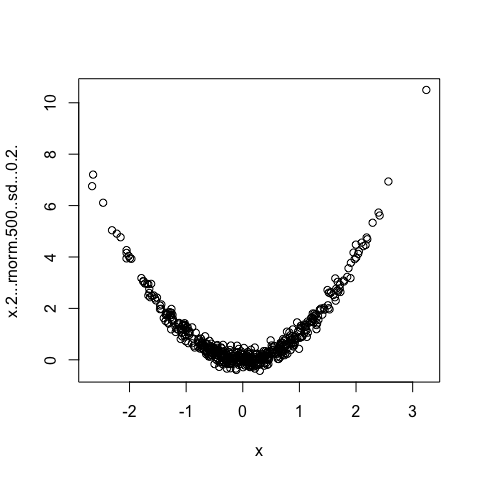
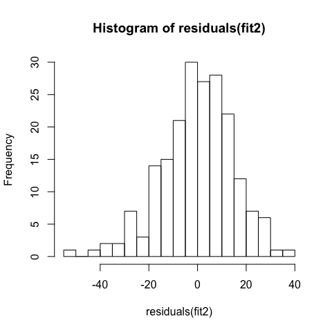

# Übung 6 - Allgemeine Testfragen
Florian Hartig  
7 Dec 2016  


# Deskriptive Statistik


**Frage** Was ist der Unterschied zwischen deskriptiver und schließender Statistik?

**Antwort** Deskriptive Statistik ist eine reine Zusammenfassung der Daten. Schließende Statistik benutzt Wahrscheinlichkeitsaussagen (wie wahrscheinlich wäre es diese Daten zu sehen wenn kein Effekt da ist) um Schlüsse aus den Daten zu ziehen. 


**Frage** Rechnen Sie Mittelwert, Standardabweichung und Schiefe für die folgenden Daten aus: - 1 , 0, 1 

**Antwort** Mittelwert: 0, sd = sqrt(1/3 * (-1^2 + 0^2 + 1^2) ) = sqrt(2/3), Schiefe = 0


**Frage** Wenn der Mittewert wesentlich größer ist als der Median, was lässt sich dann über die wahrscheinliche Schiefe der Verteilung aussagen?

**Antwort** Schiefe > 0 = rechtsschief. Tip: lesen Sie noch mal die Artikel über Schiefe, Mittelwert usw. auf Wikipedia, siehe, z.B. https://de.wikipedia.org/wiki/Schiefe_(Statistik)

**Frage** Ist die Person Korrelation der folgenden Daten negativ, positiv, oder Null?




**Antwort** Null


**Frage** Würde sich bei Anwendung eines Rangkorrelationskoeffizienten (z.B. Spearmann, siehe Vorlesung) eine andere Antwort ergeben?

**Antwort** Nein, der wäre auch Null


**Frage** Was ist der Unterschied zwischen Korrelation und Assoziation?

**Antwort** Eine Beziehung zwischen 2 Variablen heißt Korrelation wenn beide Variable metrisch sind, ansonsten Assoziation 

**Frage** Welche anderen Skalenniveaus gibt es denn noch, außer metrisch?

**Antwort** nominal (ungeordnet), ordinal (geordnet)

**Frage** Geben Sie ein Beispiel für eine nominale Variable

**Antwort** Eine Variable mit den Werten: winzig, mittel, groß


# Hypothesentests


**Frage** Warum hat der p-Wert bei einem Signifikanzlevel von 0.05 genau 0.05 falsche Positive?

**Antwort** Der p-Wert ist die Wahrscheinlichkeit einen gegebenen Wert (definiert durch die Teststatistik) oder größer zu erhalten wenn H0 wahr ist - diese Definition impliziert, dass die Wahrscheinlihckeit einen p-Wert unter 5% zu bekommen 5% ist wenn H0 wahr ist (wenn Ihnen das nicht einleuchtet schauen sie noch mal auf die visuelle Erklärung des p-Wertes aus der Vorlesung). 


**Frage** Was ist der Unterschied zwischen Typ I Fehler und der "False Discovery Rate"

**Antwort** Typ I Fehlerrate = wie häufig treten falsche Positive auf wenn H0 wahr ist. FDR = wie häufig treten falsche Positive auf wenn H0 mit einer Wahrscheinlichkeit p(H0) wahr ist.


**Frage** Geben Sie die false discovery rate an für Signifikanzlevel 0.05, Power = 0.4, p(H0) = 0.5

**Antwort** 0.05 * 0.5 / (0.05 * 0.5 + 0.4 * 0.5) -> Rate Typ I / (Rate Typ I + Rate echte Positive)


**Frage** Der p-Wert eines Experiments 0.04 - ist die folgende Aussage richtig: die Wahrscheinlichkeit dass H0 wahr ist ist kleiner als 4%? Begründen Sie ihre Antwort.

**Antwort** Nein. Begründung: p-Wert gibt Wahrscheinlichkeit der Daten gegeben H0 - wie wahrscheinlich es dann ist dass H0 oder nicht H0 zutrifft kann man daraus nicht sehen. Wenn überhaupt müsste man für eine solche Aussage die FDR berechnen. 


# MLE und Regression


**Frage** Wie funktioniert die Methode des Maximum Likelihood Schätzers in Worten?

**Antwort** Man stellt ein Modell für die Wahrscheinlichkeit der Daten gegeben die Parameter auf (Likelihood). Dann such man die Parameter für die diese Wahrscheinlichkeit der Daten maximal ist. 

Die folgenden Fragen beziehen sich auf dieses Regressionsergebnis


```r
library(agridat)
fit2 <- lm(roots ~ leaves + I(leaves^2), data = mercer.mangold.uniformity)
summary(fit2)
```

```
## 
## Call:
## lm(formula = roots ~ leaves + I(leaves^2), data = mercer.mangold.uniformity)
## 
## Residuals:
##     Min      1Q  Median      3Q     Max 
## -51.449  -8.508   0.672   9.817  36.662 
## 
## Coefficients:
##              Estimate Std. Error t value Pr(>|t|)    
## (Intercept) -33.54052   63.94141  -0.525 0.600485    
## leaves       12.19976    2.59622   4.699  4.9e-06 ***
## I(leaves^2)  -0.09561    0.02623  -3.645 0.000342 ***
## ---
## Signif. codes:  0 '***' 0.001 '**' 0.01 '*' 0.05 '.' 0.1 ' ' 1
## 
## Residual standard error: 14.77 on 197 degrees of freedom
## Multiple R-squared:  0.4793,	Adjusted R-squared:  0.474 
## F-statistic: 90.68 on 2 and 197 DF,  p-value: < 2.2e-16
```

**Frage** Was für eine Kurve wird hier gefittet?


**Antwort** Eine der folgenden Antworten wäre ausreichend: Polynom 2. Ordnung, quadratisches Polynom, y = a0 + a1*x + a2 * x2^2 

**Frage** Schreiben sie die Funktion auf, für die nach der oben stehenden Berechnung in R die Likelihood maximal wird (dem MLE)

**Antwort** roots = -33.54052 + 12.19976 * leaves + -0.09561 * leaves^2


**Frage** Der p-Wert für den Achsenabschnitt (Intercept) ist ja nicht signifikant. Aber was testet eigentlich dieser Wert, d.h. was ist die Nullhypothese?

**Antwort** H0 ist: der Wert des Intercepts ist 0


**Frage** Schauen Sie auf die Kennzahlen für die Verteilung der Residuen - ist die Verteilung stark asymmetrisch  (konzentrieren Sie sich dabei auf Q1, Median, Q3 - min/max sind zu stark von einzelnen Werten beeinflusst)?

**Antwort** Nein, nicht stark asymmetrisch, fast gleiche Abstände zwischen Q1, Median, Q3


**Frage** Was sind denn eigentlich diese "Residuen"?

**Antwort** Residuen = Abstände zwischen der Modellvorhersage (Polynom, siehe Frage oben) und den Daten, d.h. es gibt ein Residuum pro Datenpunkt. 

**Frage** Wie sollten die Residuen bei der linearen Regression verteilt sein, und sieht die folgende Verteilung gut aus?





**Antwort** Sie sollten normalverteilt sein. Die Verteilung sieht grob wie eine Normalverteilung aus (kleine Linksschiefe, aber ein paar Schwankungen sind natürlich immer da)


# Experimentelles Design


**Frage** Warum sollten Sie skeptisch sein wenn Sie in einer Studie lesen, dass das Tragen von teurem Goldschmuck die Gesundheit fördert? (die Studie untersuchte 5000 zufällig ausgewählte Personen aus der deutschen Bevölkerung. In einer einfachen Regression zeigte sich, dass das Tragen von Goldschmuck ein signifikanter Prädiktor für die Lebenserwartung ist. 

**Antwort** Weil offensichtliche Störfaktoren nicht bedacht wurden (welche klären wir mit der nächsten Frage)


**Frage** Nennen Sie mindestens 2 offensichtliche Störfaktoren um einen Zusammenhang zwischen Goldschmuck und Lebenserwartung in einer Zufällig ausgewählten Stichprobe von Personen nachzuweisen, zusammen mit der Erklärung warum diese Faktoren Störfaktoren sind (Korrelation mit erkl. und abh. Variable)

**Antwort** Geschlecht (Frauen leben länge und Frauen tragen mehr Schmuck), Vermögen (vermögende Personen haben mehr Goldschmuck, und typischerweise auch bessere Gesundheit)


**Frage** Welcher Typ von Validität war in dieser Studie nicht gegeben?

**Antwort** Interne Validität


**Frage** Erklären sie am Beispiel der oben genannten Studie das Konzept der externen Validität. 

**Antwort** externen Validität = kann man die Studienergebnisse verallgemeinern. Externe Validität würde, z.B., die Frage bezeichnen ob man die Ergebnisse der gegebenen Stichprobe auf die deutsche Bevölkerung oder Menschen im allgemeinen (ganze Welt) verallgemeinern kann. 


**Frage** Wenn man wissen will wie viele Beobachtungen (Replikate) man für ein Expiriment braucht macht man ...

**Antwort** eine Poweranalyse


# R - Weinachtskarte

Das wars mit den Frage - zur Entspannung: wenn Sie über die Feiertage noch Weihnachtsgrüße an einen befreundeten Statistiker schicken müssen, so versenden Sie doch einfach diese R Weihnachtskarte (natürlich als Code, R hat der ja immer offen). Der R code wurde erstellt von der Kollegin [Carline Tucker](http://www.carolinemtucker.com/), zur Zeit CNRS in Montpellier. 

Natürlich auch Ihnen Frohe Feiertage!


```r
#Holiday caRd 2016
#Caroline M. Tucker

##install library
#install.packages("igraph")
library("igraph")

###Make SI model
par(bg="aliceblue")
#Initial set up
size=50 #number of vertices
rate <- 0.10 #infection rate
infnum <- round(seq(from=0, to=size, length.out=10)) #initial infection

#wreath <- make_ring(size)
wreath <- graph.ring(size)
wreathN = connect.neighborhood(wreath, 7) 
V(wreathN)$color <- "yellow3"
V(wreathN)$size <- runif(size, 2, 7)
wreathN$AdjList = get.adjlist(wreathN, mode="out")
L=layout.fruchterman.reingold(wreathN) #layout_with_fr(wreathN)

#Plot
plot(wreathN, vertex.label=NA, vertex.size=V(wreathN)$size, edge.width=2, edge.color="green", vertex.color=V(wreathN)$color, vertex.frame.color=NA, edge.curved=0.2, layout=L)

	for(i in 1:25){ #timesteps
		oldinf <- infnum	#recovering
		newinf <- sort(unlist(lapply(wreathN$AdjList[infnum], FUN=function(X){sample(X, round(length(X)*rate))})))
		V(wreathN)$color <- "yellow" #all
		V(wreathN)$color[oldinf] <- "orange" #recovering
		V(wreathN)$color[newinf] <- "red" #new infected
		V(wreathN)$size[newinf] <- 5 
		plot(delete.edges(wreathN, E(wreathN)), vertex.size=runif(size, 1, 10), vertex.label=NA, edge.width=0, vertex.frame.color=c("lightgrey"), add=TRUE, layout=L)
				}
				
text(0, 0, "Happy Holidays! \n2016", cex=2, col=c("darkgreen"), font=2.1, family="serif")
text(0.5, -1.2, "\n from the EEB & Flow", font=2, col="darkred", cex=1.5, family="serif")
```


